---

**
<a name="page_1">1</a>
**

---

# Frosthaven Rule Book

This is a ligthweight, searchable, version of the Frosthaven Rule Book, inspired by https://github.com/m-ender/gloomhaven-rules. 

**Since I do not want to spoil myself this will not contain any of the stickers until we unlock them.**

I've made a separate document that only lists the parts of the Rule Book that are marked as [new in Frosthaven.](./new-to-frosthaven.md)

All text taken from the original Rule Book (as uploaded to https://github.com/any2cards/worldhaven). Icons taken from https://github.com/any2cards/worldhaven. All mistakes are mine. PR's welcome, **as long as they do not contain spoilers.**

© 2022 Cephalofair Games, LLC. All Rights Reserved.

---

**
<a href="#page_1">🔝</a>&nbsp; &nbsp;<a name="page_2">2</a>
**

---

# Table Of Contents

## Getting Started [p.3](#page_3)
1. Starting Character Classes [p.3](#page_3)
1. Creating a Character [p.4](#page_4)
1. Learning the Rules [p.6](#page_6)
## Scenario Phase [p.7](#page_7)
### Beginning a Scenario [p.8](#page_8)
1. Scenario Entries [p.10](#page_10)
    1. Road Events [p.12](#page_12)
    1. Map Tiles and Walls [p.13](#page_13)
    1. Overlay Tiles [p.13](#page_13)
    1. Loot Deck [p.16](#page_16)
1. Scenario Level [p.16](#page_16)
1. Battle Goals [p.17](#page_17)
### Playing a Scenario [p.18](#page_18)
1. Card Selection [p.18](#page_18)
1. Ordering of Initiative [p.19](#page_19)
1. Character and Monster Turns [p.20](#page_20)
    1. Actions and Abilities Overview [p.20](#page_20)
    1. Important Ability Concepts [p.21](#page_21)
        1. Line-of-Sight [p.21](#page_21)
        1. Target [p.21](#page_21)
        1. Allies, Enemies, and Self [p.21](#page_21)
        1. Range [p.21](#page_21)
        1. Area of Effect [p.22](#page_22)
        1. Added Effects [p.22](#page_22)
        1. Conditional Triggers [p.22](#page_22)
        1. Elements [p.23](#page_23)
    1. Abilities [p.24](#page_24)
        1. Move [p.24](#page_24)
            1. Jump [p.24](#page_24)
            1. Flying [p.24](#page_24)
        1. Teleport [p.24](#page_24)
        1. Attack [p.25](#page_25)
            1. Attack Modification Order [p.25](#page_25)
            1. Attack Modifier Cards [p.25](#page_25)
            1. Attack Effects [p.26](#page_26)
            1. Advantage and Disadvantage [p.27](#page_27)
            1. Pierce [p.27](#page_27)
        1. Conditions [p.28](#page_28)
            1. Positive Conditions [p.28](#page_28)
            1. Negative Conditions [p.29](#page_29)
        1. Heal [p.29](#page_29)
        1. Active Bonuses [p.30](#page_30)
            1. Shield [p.31](#page_31)
            1. Retaliate [p.31](#page_31)
            1. Summon [p.31](#page_31)
        1. Forced Movement [p.32](#page_32)
        1. Suffer Damage [p.32](#page_32)
        1. Loot [p.32](#page_32)
        1. Recover [p.33](#page_33)
        1. Commanding Figures [p.33](#page_33)
        1. Manipulating Tiles [p.33](#page_33)
    1. Character Turns [p.34](#page_34)
        1. Character Ability Cards [p.34](#page_34)
        1. Items [p.35](#page_35)
            1. Item Usage [p.36](#page_36)
        1. Mandatory Triggers [p.37](#page_37)
        1. Experience [p.37](#page_37)
        1. End-of-Turn Looting [p.37](#page_37)
        1. Resting [p.38](#page_38)
        1. Lost Actions [p.38](#page_38)
        1. Character Damage [p.38](#page_38)
        1. Exhaustion [p.38](#page_38)
    1. Monster Turns [p.39](#page_39)
        1. Monster Stat Cards [p.39](#page_39)
        1. Monster Ability Cards [p.40](#page_40)
        1. Monster Acting Order [p.40](#page_40)
        1. Focus [p.41](#page_41)
        1. Monster Movement [p.42](#page_42)
        1. Monster Attacks [p.42](#page_42)
        1. Other Monster Abilities [p.43](#page_43)
        1. Monsters and Elements [p.43](#page_43)
        1. Revealing and Spawning Monsters [p.44](#page_44)
        1. Named Monsters [p.44](#page_44)
        1. Bosses [p.45](#page_45)
        1. Monster Damage and Death [p.45](#page_45)
            1. Kill Credit [p.45](#page_45)
1. End of Round [p.46](#page_46)
1. Common Scenario Rules [p.46](#page_46)
## Ending a Scenario [p.47](#page_47)
1. Lost Scenario [p.47](#page_47)
1. Completed Scenario [p.48](#page_48)
## The Adventure Begins [p.49](#page_49)
### Campaign Overview [p.50](#page_50)
1. Map Board [p.50](#page_50)
1. Scenario Flowchart [p.51](#page_51)
1. Building Deck [p.52](#page_52)
1. Character Sheet [p.53](#page_53)
1. Campaign Sheet [p.54](#page_54)
1. Resources [p.56](#page_56)
1. Town Guard Deck [p.56](#page_56)
1. Unlocking New Buildings [p.57](#page_57)
1. Unlocking New Classes [p.57](#page_57)
1. Item Supplies [p.58](#page_58)
### Outpost Phase [p.59](#page_59)
1. Passage of Time [p.59](#page_59)
1. Outpost Event [p.60](#page_60)
    1. Attack Events [p.60](#page_60)
    1. Defense Checks [p.61](#page_61)
    1. Damaged Buildings [p.61](#page_61)
    1. Wrecked Buildings [p.61](#page_61)
1. Building Operations [p.62](#page_62)
1. Downtime [p.62](#page_62)
    1. Level Up [p.62](#page_62)
        1. Perks [p.63](#page_63)
    1. Retire a Character [p.64](#page_64)
    1. Create a Character [p.65](#page_65)
    1. Craft Items [p.65](#page_65)
    1. Brew Potions [p.66](#page_66)
    1. Sell Items [p.67](#page_67)
    1. Purchase Items [p.67](#page_67)
1. Construction [p.68](#page_68)
## Game Variants [p.69](#page_69)
1. Casual Mode [p.69](#page_69)
1. Crossover Classes [p.69](#page_69)
1. Spoiler Variant [p.69](#page_69)
1. Reduced Randomness [p.69](#page_69)
1. Solo Mode [p.69](#page_69)
1. Open Information [p.69](#page_69)
1. Permanent Death [p.70](#page_70)
1. Character Respeccing [p.70](#page_70)
1. Random Dungeons [p.70](#page_70)
## Appendices <spoiler> [p.72](#page_72)
1. Appendix A: Component Inventory [p.72](#page_72)
1. Appendix B: Monster Turn Guide [p.74](#page_74)
1. Appendix C: Important Reminders [p.76](#page_76)
1. Appendix D: <Spoiler> [p.77](#page_77)
1. Appendix E: Treasure Index [p.78](#page_78)
1. Appendix F: <Spoiler> [p.79](#page_79)
1. Appendix G: Index [p.80](#page_80)
## Credits <spoiler> [p.82](#page_82)
## Quick Reference [p.84](#page_84)

---

**
<a href="#page_1">🔝</a>&nbsp; &nbsp;<a name="page_3">3</a>
**

---

# Getting Started

Your goal is to keep the outpost of Frosthaven safe from all threats. Your party of mercenaries will do this by venturing out into the wilderness in various scenarios. Once a scenario is completed, new scenarios become available, which progresses the campaign narrative. Between scenarios, your party will return to Frosthaven to resolve events, acquire new items and abilities, and interact with buildings.

The heart of the game lies in its characters, which you will create from the six starting character classes, though more will become available as the campaign progresses. The game can be played with two to four players, and each player will use a separate character. (See [p.69](#page_69) for solo mode rules.) Each character class, indicated by a different icon, has a unique set of ability cards that determine how they play.

# Starting Character Classes

## Banner Spear
### Low Complexity

Natural leader and protector with powerful attacks that require proper positioning.

## Drifter
### Low Complexity

Jack-of-all-trades with great stamina to fill any role you need.

## Boneshaper
### Medium Complexity

Summoner of the undead who sacrifices their health to create and heal allies.

## Deathwalker
### Medium Complexity

Manipulator of dead spirits who uses death as fuel for their abilities.

## Blinkblade
### High Complexity

Powerful melee fighter who is able to quickly zip in and out of combat.

## Geminate
### High Complexity

Insect swarm with two separate forms that allow for switching between melee and ranged attacks.

---

**
<a href="#page_1">🔝</a>&nbsp; &nbsp;<a name="page_4">4</a>
**

---

# Creating a Character

Let’s take a closer look at the components of a character. Once you have decided which character class you would like to play, find the small tuck box and large tuck box for that class and open them up.

Inside the small tuck box, you will find a plastic miniature, which is used to represent your character in every scenario. (Note: The Geminate has two small tuck boxes because they have two separate forms.)

Inside the large tuck box, you will find several things:

* (A) **Character Sheets**: This sheet is where you will track all persistent information about your character from scenario to scenario. Write a name for your character in the Name field and mark that you are level 1. Initial characters start with 30 gold, so write "30" in the Gold field. There are multiple sheets in each pad because the same class can be played multiple times over the course of a single campaign. However, there can only be one character of each class at a given time, so you only need one sheet for now. (For more on character sheets, see [p.53](#page_53))
* (B) **Character Mat**: This mat stays in front of you during a scenario to help you track important rules and various aspects of your character. On the mat, you will find an illustration of your character, plus their hand size, traits, and maximum hit point value at different levels. The back side features a thematic description of your character.
* (C) **Character Standee**: This standee is an alternative to your plastic miniature. You can use either the standee or the miniature to represent your character, based on your preference.
* (D) **Summon Standees**: If your character has abilities that can summon allies into a scenario, you have summon standees for these allies. These allies do not have miniatures, so you must use the standees to represent them.
* (E) **Character Tokens**: These tokens are used to track various abilities belonging to your character.
* (F) **Initiative Order Token**: This token is used to mark when your turn will occur within any given round of a scenario
---

**
<a href="#page_1">🔝</a>&nbsp; &nbsp;<a name="page_5">5</a>
**

---
* (G) **Ability Cards**: These cards are what make your character unique. They represent the dynamic actions you can perform during a scenario. For now, the most important part of these cards is their level, which is indicated in the upper left corner. If you are unfamiliar with the character, it is recommended that you only play with the level 1 cards for your first game. There are a number of these equal to your hand size. If you are more experienced, you may consider also using the level X cards, which are typically more complicated and situational. You can only bring into a scenario a number of ability cards equal to your hand size, so adding level X cards to your hand means removing an equal number of level 1 cards from your hand. Don’t worry, you can change your selections for each scenario.(For more on ability cards, see [p.34](#page_34))
* (H) **Advanced Attack Modifier Cards and Perk Reminder Cards**: These cards, marked with your class icon, are only needed as your character grows in power, so you won’t be using them for now. (For more on attack modifier cards, see [p.25](#page_25))

There are a few more things your character will need before they are ready:

* (A) **Standard Attack Modifier Deck**: There are six of these 20-card decks in the insert, labeled individually. There is one deck for each character (<picture></picture>, <picture></picture>, <picture></picture>, <picture></picture>), one deck for scenario allies (<picture></picture>), and one deck for the monsters (<picture></picture>). Each deck contains six <picture>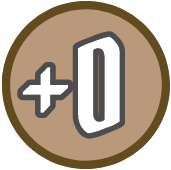</picture>, five <picture>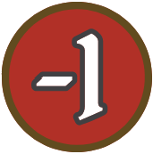</picture>, five <picture>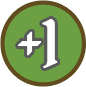</picture>, one <picture>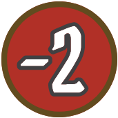</picture>, one <picture>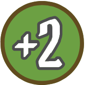</picture>, one <picture>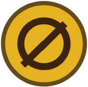</picture>, and one <picture>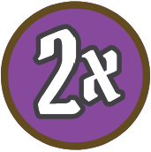</picture>
* (B) **Personal Quest**: Draw two cards from the personal quest deck. Keep one and shuffle the other back into the deck. This card represents your character’s reason for coming to Frosthaven. Once you complete this personal quest, you will retire your character and choose a new character, unlocking new campaign elements in the process. Personal quests can be secret or public, as the party decides.
* (C) **Character Dial**: This dial is used to track your character’s hit points and experience during a scenario.

---

**
<a href="#page_1">🔝</a>&nbsp; &nbsp;<a name="page_6">6</a>
**

---

* (D) **Items**: You have 30 starting gold to spend on items. Items provide extra bonuses or abilities for your character. You can purchase any of the items in the available purchasable supply (items 120–128). If you own Gloomhaven, you can also purchase any of the following items from Gloomhaven: items 10, 25, 72, 105, 109, and 116. When you are done purchasing items with your starting gold, any unspent remainder is lost.(For more on items, see [p.35](#page_35)) If you are not sure what to purchase, here are some suggested purchases for each starting class.

| Class Name | Suggested Purchase |
|---|---|
|Banner Spear|Winged Shoes 124, Heater Shield 128|
|Drifter|Amulet of Life 120, Winged Shoes 124|
|Boneshaper|Warden’s Robes 122|
|Deathwalker|Boots of Speed 125|
|Blinkblade|Leather Armor 123, Poison Dagger 127|
|Geminate|Amulet of Life 120, Leather Armor 123|

# Learning the Rules

With your characters created, it is time to tackle the rules. If you would prefer not to read the rulebook and instead watch a video, you can find one here:

[cephalofair.com/frosthaven](https://cephalofair.com/frosthaven)

The rules are broken up into two main sections: rules for playing through a scenario and rules for what you can do between scenarios. To start with, you’ll need to familiarize yourself with the scenario rules, though you can skip over the following sections:

* **Road Events**: These will not occur at the start of the first scenario.
* **Scenario Level**: This will be set to "1" for the first few scenarios

> <picture></picture> If you are already experienced with the Gloomhaven system, you can look through the "Scenario Phase" section and read only the parts in blue (like this one), which isolate the scenario rules that are exclusive to Frosthaven. If you are only familiar with Jaws of the Lion, it is recommended that you read through the entire rulebook before you begin.

Once you are familiar with the scenario rules, feel free to jump into your first scenario by following the instructions of "The Adventure Begins" section on [p.49](#page_49). If you are completely new to the Gloomhaven system, it is not only recommended that you read through the entire rulebook, but also that you start the game with scenario 0.

If you are ever unsure about something and need to find it again in the rulebook, there is an "Index" section on [p.80](#page_80) to help with that as well as an "Important Reminders" section on [p.76](#page_76) for commonly overlooked rules.

As with any game of this size and scope, there might be cases when the rules offer no definitive answer and multiple interpretations seem equally viable. Remember this universal rule: **The party decides ambiguity.** Just make whatever decision you’d like about how to resolve the situation. And if you need extra clarification for something, the official FAQ will be maintained at [cephalofair.com/frosthaven](https://cephalofair.com/frosthaven).

Lastly, you will find that some sections of the rulebook have been left blank. You will be directed to fill these blank sections with stickers describing new rules, as you open certain sealed envelopes, so don’t worry about them for now.

---

**
<a href="#page_1">🔝</a>&nbsp; &nbsp;<a name="page_7">7</a>
**

---

# Scenario Phase

Scenarios are self-contained missions designed to be played in a single sitting. The campaign of Frosthavenspans numerous scenarios, and most of your time in the campaign will be spent playing through these scenarios. The scenario book contains 138 scenarios, but you will not play through them all, and they will not be played in order. The story contains many branching paths and detours.

Each Scenario Phase consists of three distinct steps:

* **Beginning a Scenario**: In this step, the party will prepare everything needed for the scenario, including their own characters, the monsters they will fight against, and the map layout where the fight will occur.
* **Playing a Scenario**: This step occurs over a series of rounds. Within each round, all figureson the map, both characters and monsters, will take a turn. The party will play through round after round until the scenario is lost or completed.
* **Ending a Scenario**: In this step, the party will resolve the effects of losing or completing the scenario.

> <picture></picture> In addition to the scenario book, the section book will also be important for playing through a scenario. Any time you see the section book icon <picture></picture>, read the specified section in the section book. The number before the period is the specific page number, and the number after the period is the specific section on that page.

---

**
<a href="#page_1">🔝</a>&nbsp; &nbsp;<a name="page_8">8</a>
**

---

# Beginning a Scenario

Whenever a scenario is played, the party will prepare for the scenario by performing the following steps in order:

1. Select which scenario to play, open the scenario book to the corresponding scenario entry, and keep the section book nearby. The party can only play a scenario if it has been unlocked and if they meet its requirements. This does include scenarios that have been completed previously.
1. Resolve a road event if necessary (see [p.12](#page_12)).
1. Set up all map tiles for the scenario as depicted in the map layout for the scenario entry.
1. Retrieve the materials (ability deck, stat card, standees, and initiative tracker) for all monsters shown in the scenario key. Shuffle the ability decks and insert the stat cards in stat sleeves so that only the relevant stats are shown.
1. Retrieve all overlay tiles shown in the scenario key.
1. Set up the first room of the scenario as depicted in the main map for the scenario entry.
1. Retrieve and shuffle all necessary attack modifier decks (character, monster, and ally decks) and retrieve all additional attack modifier cards (<picture></picture>, <picture></picture>, and <picture></picture> cards).
1. Read the scenario goals, introduction, and special rules in the scenario entry.
1. > <picture></picture> Deal three battle goals to each character. Decide which one to keep for each character and discard the others (see [p.17](#page_17)).
1. Sticker 1
1. > <picture></picture> Place the token tray nearby.
1. > <picture></picture> Build the loot deck as depicted by the loot table in the scenario entry (see [p.16](#page_16)).
1. Sticker 2
1. Sticker 3
1. Decide which items to bring for each character from their pool and apply any negative effects and start-of-scenario effects associated with those items (see [p.35](#page_35)).
1. Decide which ability cards to bring for each character from their pool, selecting a number of cards equal to their hand size, which is shown below the portrait on their character mat. Each character’s selected cards will start in their hand.
1. Set each character’s red hit point dial to their maximum hit point value, which is shown below their current level in the chart at the bottom of their character mat. Set each character’s blue experience dial to zero.
1. Apply any road event effects and scenario effects.

---

**
<a href="#page_1">🔝</a>&nbsp; &nbsp;<a name="page_9">9</a>
**

---

---

**
<a href="#page_1">🔝</a>&nbsp; &nbsp;<a name="page_10">10</a>
**

---

## Scenario Entries

Each scenario entry in the scenario book is critical to setting up and playing that scenario. Most scenario entries contain the following information:

* (A) The scenario’s name and number.
* (B) The scenario’s grid coordinates on the map board (or "FR" if the scenario takes place within Frosthaven itself).
* <blockquote>(C) <picture></picture> Any requirements for playing the scenario, including necessary campaign stickers or special travel icons that require the corresponding building upgrade.</blockquote>
* <blockquote>(D) <picture></picture> The complexity of the scenario, on a scale of 1–3. Higher complexity scenarios will generally take longer and have more special rules.</blockquote>
* <blockquote>(E) <picture></picture> The geographical feature where the scenario is located (if any).</blockquote>
* <blockquote>(F) <picture></picture> The designers and writers of the scenario (side scenarios only).</blockquote>
* <blockquote>(G) <picture></picture> The goal of the scenario. When this is achieved, the scenario is completed, and the specified section in the section book should be read at the end of the current round for the conclusion and rewards.</blockquote>
* (H) An introduction to the scenario.
* (I) Any special rules for the scenario.
* (J) Any scenario effects applied to characters.
* <blockquote>(K) <picture></picture> Section links, which will describe when you should reference the section book for additional information (see <a href="#page_7">p.7</a>). Important elements such as additional room setups can be found in these sections. Section links are read immediately when the condition described is fulfilled, even if it interrupts an ability.</blockquote>
* <blockquote>(L) <picture></picture> The configuration of map tiles needed for the entire scenario, with each map tile labeled. Most of the time, this will be more than the initial room. Do not reference the setup for any additional rooms, which will be detailed in the section book, until instructed. However, the map tiles for the entire scenario can be placed at once.</blockquote>
* <blockquote>(M) <picture></picture> The composition of the loot deck (see <a href="#page_16">p.16</a>).</blockquote>
* (N) The scenario key, which shows the monsters and overlay tiles needed for the entire scenario, even if they are not needed initially

---

**
<a href="#page_1">🔝</a>&nbsp; &nbsp;<a name="page_11">11</a>
**

---

Each scenario entry also displays a detailed layout of the initial room of the scenario. This often includes the following information:

* (A) **Starting Hexes**: The characters can each place their figure (miniature or standee) in any of these hexes at the start of the scenario. However, no hex can ever contain more than one figure.
* (B) **Overlay Tiles**: These are smaller hex tiles placed on top of the map tiles to create additional map features (see [p.13](#page_13)).
* <blockquote>(C) <picture></picture> <strong>Loot Tokens</strong>: These are objects on the map that characters can interact with to gain rewards from the loot deck (see <a href="#page_32">p.32</a>).</blockquote>
* (D) **Monster Placements**: These hexes show colored bars to indicate monster placements by rank. The top bar is for two characters, the middle bar is for three characters, and the bottom bar is for four characters. Black means no monster, white means a normal monster, and yellow means an elite monster. Place each monster standee in a base whose color matches its rank. All standees for a monster type are numbered and should be randomized upon placement.
* (E) **Notable Hexes**: These hexes, denoted with letters and numbers, are explained in the special rules or section links. If the icon is green, place the corresponding scenario aid token in the hex, but if the icon is gray, do not place the token

---

**
<a href="#page_1">🔝</a>&nbsp; &nbsp;<a name="page_12">12</a>
**

---

### Road Events

 A road event is a small thematic interaction that takes place in the world around Frosthaven. The party will resolve a road event at the start of each scenario, with the following exceptions:

* At the start of scenario 0 and scenario 1.
* When replaying a lost scenario without first returning to Frosthaven.
* When moving directly to a new scenario that is linked to the previous scenario (see [p.48](#page_48)).
* When playing a scenario that takes place within Frosthaven itself.
* When playing any scenario in casual mode (see [p.69](#page_69)).

> <picture></picture> There are two decks of road events: summer and winter. Draw the top card of the active road event deck that corresponds to the current season, as shown by the next unmarked box on the campaign calendar (see [p.54](#page_54)).

The party will perform the following steps when resolving an event card:
1. Read the thematic text on the front of the card.
1. Collectively choose one of the options.
1. Read the thematic text on the back of the card for the outcome that corresponds to the chosen option, then resolve the effect written in that section. Only characters who are participating in the scenario are affected by the outcome. Do not read any of the text that corresponds to the other outcome.
1. Remove the card from the game. If the return icon <picture></picture> is depicted in the outcome, return the card to the bottom of the corresponding road event deck instead.

> <picture></picture> Some options and outcomes have requirements associated with them. The most common requirement checks whether any of the characters has a specific trait <picture></picture> listed on the front of their character mat. Other requirements might refer to the gold, resources, or other campaign stats you have, or whether specific achievement stickers are present on the campaign sheet (see [p.54](#page_54)). When the word "collective" is used, the requirement refers to the entire party and can also include any collective resources listed on the campaign sheet. If the requirement is not met, instead read the outcome labeled "otherwise."

Each event also has a reference number A. Throughout the campaign, you will be instructed to add or remove events from the various event decks. These events are always referenced by this number so that they can be easily found. When an event is added to or removed from an event deck, that deck must then be shuffled. Certain events also have an additional icon (<picture>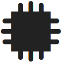</picture>/<picture></picture>/<picture>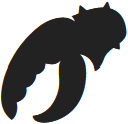</picture>) to make it easier to identify a large number of cards at once. 

## Sticker 4

---

**
<a href="#page_1">🔝</a>&nbsp; &nbsp;<a name="page_13">13</a>
**

---

### Map Tiles and Walls

> <picture></picture> Each map tile is considered to be full of empty hexes (no overlay tiles or figures). These traversable hexes are surrounded by walls consisting of border hexes separated by wall lines.

Wall lines cannot be crossed, and a grouping of hexes surrounded by walls is considered a **room**. A hex is considered adjacent to a wall if it shares a border with a wall line. A hex is not considered adjacent to a hex on the other side of an adjacent wall line 

### Overlay Tiles

Overlay tiles are placed on top of map tiles to provide additional features for the scenario. The type of overlay tile is defined by the colored border of the tile, as depicted in the scenario book, not necessarily the illustration on the tile.

If the scenario layout depicts an overlay tile covering the border hex of a map tile, the overlay tile also covers up any adjacent wall lines. The overlay tile creates new wall lines between it and any adjacent border hexes without overlay tiles.

> <picture></picture> A hex with no overlay tiles (except corridors and pressure plates) is considered **featureless**. A hex with no figure is considered **unoccupied**. A hex that is both featureless and unoccupied is considered **empty**. Tokens are not overlay tiles.

|  | A | B | C |
|--|---|---|---|
|**Note:** Many overlay tiles can function as different types of overlays. For example, a snow rock tile can be used as A an obstacle, B an objective, or C a wall, depending on the border shown in the scenario layout and banner color shown in the scenario key. The type of overlay is determined by its color and icon, not necessarily the illustration on the tile or name in the scenario book.| <picture></picture> | <picture></picture> | <picture></picture> |

---

**
<a href="#page_1">🔝</a>&nbsp; &nbsp;<a name="page_14">14</a>
**

---

#### Doors

<picture></picture>  A door separates two rooms. All doors are closed to start. When a character enters a closed door, they flip over the door tile to its open side, revealing the adjacent room (see [p.44](#page_44)). Closed doors do not hinder normal character movement, but they otherwise act as walls. No figure can enter a closed door with forced movement (see [p.32](#page_32)). Once a door is open, it is considered a corridor for most purposes, but it still separates rooms and is not part of either room adjacent to it. Door illustrations vary by environment type, but all door tiles function identically.

#### Corridors

<picture></picture>  A corridor is placed on the connection of two map tiles to cover the border hexes and create a single room out of multiple map tiles. Corridors are considered empty hexes and are **not** considered to be overlay tiles for the purposes of determining what other tiles or tokens can be placed in the same hex.

#### Pressure Plates

<picture></picture>  A pressure plate’s trigger and all of its effects are defined by the special rules for the scenario. Jump and flying movements still trigger pressure plates. Pressure plates are considered empty hexes.

#### Traps

<picture></picture>  A trap is sprung when any figure enters its hex, except when flying or jumping (unless the jump movement ends there).When a trap is sprung, it applies some effect to the figure who sprang it and is then removed from the map. Trap effects are varied and are specified either by the scenario key — if they are a part of a room’s setup — or by the ability of the figure who placed the trap. If part of a trap’s effect is listed as "damage" in the scenario key, the trap will deal damage equal to 2 plus the scenario level (see [p.16](#page_16)). 
> <picture></picture> When a trap tile is placed on the map, tokens for the damage and conditions it applies should be placed on the trap tile for easy reference.

#### Hazardous Terrain

<picture></picture>  If any figure enters a hazardous terrain hex, except when flying or jumping (unless the jump movement ends there), 
> <picture></picture> that figure suffers damage equal to 1 plus one-third of the scenario level, rounded up (see [p.16](#page_16)). 
Unlike trap tiles, hazardous terrain tiles are not removed after their effect is applied; instead they remain on the map indefinitely. Figures do not suffer additional damage when starting a turn in a hazardous terrain tile or exiting a hazardous terrain hex.

#### Difficult Terrain

> <picture></picture> <picture></picture>  A figure requires 2 movement points to enter a difficult terrain hex, except when flying or jumping (even if the jump movement ends there).

#### Icy Terrain

> <picture></picture> <picture></picture>  If any figure enters an icy terrain hex, except when teleporting, flying, or jumping (even if the jump movement ends there), that figure is forced to move one additional hex, without spending a movement point, in the same direction as the movement that caused them to enter the hex. This extra movement is unaffected by difficult terrain, but it will not occur if it would cause the figure to move through a wall line or to enter a hex occupied by another figure, obstacle, or objective. If the movement causes the figure to enter another icy terrain hex, the effect triggers again.

---

**
<a href="#page_1">🔝</a>&nbsp; &nbsp;<a name="page_15">15</a>
**

---

#### Obstacles

<picture></picture>  Figures cannot enter a hex with an obstacle, except when flying or jumping (unless the jump movement would end there). Obstacles do not block line-of-sight (see [p.21](#page_21)).

#### Objectives

> <picture></picture> <picture></picture>  Objectives are tied to the goals of some scenarios and typically need to be destroyed or protected. In either case, the special rules for the scenario will assign a maximum hit point value to each objective, usually based on the scenario level (see [p.16](#page_16)) and the number of characters. Objectives can be targeted by attacks and suffer damage, but are immune to all conditions and forced movement. Objectives are considered to have initiative 99 for the purpose of focusing, unless otherwise stated by the special rules for the scenario, but do not take turns. Any damage an objective suffers is marked by placing damage tokens directly on it. When the total damage suffered by an objective is equal to or greater than its maximum hit point value, the objective is destroyed, and the objective tile is removed from the map. Objectives are considered figures, and the hexes they are in are considered occupied. Objectives are not considered obstacles.

#### Walls

> <picture></picture> <picture></picture>  Like the walls on the border of a map tile, figures cannot cross the wall lines into a wall hex by any means, even when flying or jumping. Any section of a map tile surrounded by wall lines is considered to be a separate room.

#### Treasures

<picture>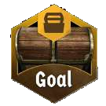</picture>  Treasure can be looted by characters (see [p.32](#page_32)). When a treasure is looted, its effect is applied and the treasure tile is removed from the map.

<picture></picture>  Goal treasure is related to the completion of a scenario, with effects specified in the special rules for the scenario. Numbered treasure is more varied, with effects specified in the Treasure Index (see [p.78](#page_78)).

* > <picture></picture> If the treasure provides an item, find one copy of that item in the unavailable supply and add it to your pool of items. You may then use it normally for the remainder of the scenario as if you had brought it into the scenario, even if it puts you above the limit for that type of item (see [p.35](#page_35)).
* If the treasure provides an item blueprint, find all copies of that item in the unavailable supply and add them to the available craftable supply (see [p.58](#page_58)).
* If the treasure provides a random item blueprint, draw a card from the shuffled random item blueprint deck and add it and all other copies of that item (found in the unavailable craftable supply) to the available craftable supply (see [p.58](#page_58)). 
> <picture></picture> If there are no cards left in the random item blueprint deck, gain 1 inspiration instead (see [p.54](#page_54)).
* If the treasure unlocks a random scenario, draw a card from the random scenario deck, read the section specified on the card in the section book, and then remove the card from the game. 
> <picture></picture> If there are no cards left in the random scenario deck, gain 1 inspiration instead (see [p.54](#page_54)).

When a numbered treasure is looted, check it off in the Treasure Index (see [p.78](#page_78)) and cross it out in the scenario book or section book, because it cannot be looted again if the party replays the scenario.

---

**
<a href="#page_1">🔝</a>&nbsp; &nbsp;<a name="page_16">16</a>
**

---

### Loot Deck

> <picture></picture> Each scenario will have a custom loot deck, built as directed by its scenario book entry and consisting of different types of loot cards. The number of cards of each type specified should be randomly drawn from their own individual decks and shuffled together to form the loot deck. 
>
> The four different types of loot are as follows:
>
> * **Money <picture></picture>:** Twenty cards depicting one to three coins, which are each converted to gold based on the scenario level (see below).
> * **Material Resources:** Eight cards per material type (lumber <picture></picture>, metal <picture></picture>, hide <picture></picture>), which provide a varying number of materials based on the number of characters in the scenario.
> * **Herb Resources:** Two cards per herb type (arrowvine <picture></picture>, axenut <picture></picture>, corpsecap <picture></picture>, flamefruit <picture></picture>, rockroot <picture></picture>, snowthistle <picture></picture>), which provide one herb each.
> * **Random Item <picture></picture>:** One card that provides a random item (see [p.32](#page_32)). This can only be gained once per scenario entry.
>
> Certain events will allow you to add a + sticker to a loot card, which provides one additional resource of that type.
>
> Money and resources looted during a scenario are not gained until the end of the scenario (see [p.47](#page_47)), but random items are gained immediately when looted.

## Scenario Level

As characters grow in power, the scenario level will also increase to ensure the game is always challenging. 

Monster base stats, trap and hazardous terrain damage, the amount of gold received from coins on loot cards, and the amount of bonus experience for completing a scenario are all dependent on the level of the scenario being played. Refer to the chart for specific values at each level. 

At recommended difficulty, the scenario level is equal to the average level of the characters **divided by 2** (rounded up). For example, if all characters are level 2, the average level (2) divided by 2 (1) means the scenario is still level 1. Only once a character reaches level 3 would the scenario level potentially increase. 

This calculation determines the recommended difficulty, but at the start of any scenario, the scenario level can be set to any number from 0–7. Decreasing the scenario level might be helpful if your party is struggling, while increasing the scenario level can help the game remain challenging as your party grows stronger. 

| Scenario Level  |0|1|2| 3| 4| 5| 6| 7|  |
|:-----------------:|:-:|:-:|:-:|:--:|:--:|:--:|:--:|:--:|:--:|
|Monster Level    |0|1|2| 3| 4| 5| 6| 7|  |
|Gold Conversion  |2|2|3| 3| 4| 4| 5| 6|  |
|Trap Damage      |2|3|4| 5| 6| 7| 8| 9|  |
|Hazardous Terrain|1|2|2| 2| 3| 3| 3| 4|<picture></picture>|
|Bonus Experience |4|6|8|10|12|14|16|18|  |

---

**
<a href="#page_1">🔝</a>&nbsp; &nbsp;<a name="page_17">17</a>
**

---

## Battle Goals

Battle goals provide an additional challenge in a scenario for characters to complete. 
> <picture></picture> At the start of every scenario, each character receives three battle goal cards in secret and chooses one to keep, discarding the others face down.
Characters should keep their battle goals secret from one another until the scenario is over. 

If the scenario is completed and the character meets the criteria of the chosen card, they will gain the number of checkmarks specified at the bottom of that card. For every set of three checkmarks, a character will gain a perk mark (see [p.63](#page_63)), up to a maximum of six extra perk marks for 18 checkmarks. If the scenario is lost, the character receives nothing from their battle goal, regardless of whether the goal was achieved.

A battle goal card has the following: 

* (A) Thematic title. 
* (B) Details for how the goal can be achieved. 
* (C) Number of checkmarks gained after achieving the goal while also completing the scenario. 

## Sticker 5

---

**
<a href="#page_1">🔝</a>&nbsp; &nbsp;<a name="page_18">18</a>
**

---

# Playing a Scenario

Once a scenario is set up, it can then be played. Each scenario is broken up into a series of **rounds**, and each round consists of the following steps:

1. Card Selection 
1. Ordering of Initiative 
1. Character and Monster Turns 
1. End of Round 

Before any of these steps occur, apply any start-of-round effects from the scenario rules, such as spawning monsters. These effects can be applied in any order, though all spawning should happen at the same time (see [p.44](#page_44)).

## Card Selection

After start-of-round effects are applied, each character secretly selects two ability cards from their hand to play face down in front of themselves. Of the two cards, one should be selected as the initiative card. The initiative value at the center of that card will determine their position in the initiative order (see [p.19](#page_19)).

Alternatively, if a character has at least two cards in their discard pile, they can instead declare a long rest at this time (see [p.38](#page_38)). They will then perform their long rest on initiative 99 as their entire turn for the round and will not play any cards.

Characters should not show each other the cards in their hand or give specific information about any **numeric value or title** on these cards. They are, however, allowed to discuss strategy and make general statements about their plans for the round.

| Communication Example |
|--|
|✅ "I’m attacking this Algox Archer near the end of the round."|
|✅ "I’m planning to move here and heal you pretty early, hopefully before the monsters attack."|
|✅ "Can you infuse earth on your turn? I will try to go after you."|
||
|❌ "You’ll need lower than 17 to go before me."|
|❌ "I’m going in the first quarter of the round."|
|❌ "I should be dealing 4 damage to the Algox Guard."|
|❌ "I need you there for Unbreakable Wall."|

---

**
<a href="#page_1">🔝</a>&nbsp; &nbsp;<a name="page_19">19</a>
**

---

## Ordering of Initiative

After each character has selected two ability cards or declared a long rest, reveal the selected cards for each character who will not be long resting. Each character’s chosen initiative card should be directly on top of the other card, so that only one initiative value is visible. All cards can now be openly discussed.

In addition, reveal one monster ability card for each monster set that has at least one figure currently on the map. Note that several **monster types** (e.g., Black Imps, Forest Imps, or Snow Imps) may belong to the same **monster set** (e.g., Imps), in which case they would all use the same monster ability deck (e.g., the Imp deck).

Determine the initiative order by comparing the initiative values on all revealed monster ability cards (located in the upper left corner) and all characters’ initiative cards. 
> <picture></picture> Take the initiative order tokens for all monster types and characters on the map and arrange them from **lowest to highest** (i.e., earliest to latest) initiative. 

Any character long resting has an initiative of 99. This indicates the turn order for this round.

### Resolving ties

If there is a tie in initiative between multiple characters, compare the initiative values of those characters’ second played cards to break the tie. If there is still a tie, the party decides the order for those characters.

If multiple monster types of the same monster set are present, the special rules for the scenario will specify the order. If there is a tie in initiative between a character and a monster set, the character acts first.

In all other tied cases, the party decides the order.

### Monster Order

During their position in the initiative order, the elites of a monster type take their turns in ascending standee number order (before any normal monsters of that type). Then, the normal monsters of that type take their turns in ascending standee number order (see [p.40](#page_40)).

### Character Summons

Character summons take their turns during the summoning character’s position in the initiative order, but immediately before the character. Multiple summons from the same character take their turns in the order they were summoned (see [p.31](#page_31)).

### Scenario Allies

Scenario allies with numbered tokens will have their initiative value specified in the special rules for the scenario. During their position in the initiative order, scenario allies take their turns in ascending token or standee number order (see [p.46](#page_46)).

---

**
<a href="#page_1">🔝</a>&nbsp; &nbsp;<a name="page_20">20</a>
**

---

## Character and Monster Turns

Every figure on the map — both characters and monsters — will get a turn each round. A figure’s turn starts when the previous figure ends their turn and concludes when the next figure begins theirs. During a figure’s turn, they will perform various actions and abilities based on their revealed ability cards.

Before we tackle the specifics of character and monster turns, we need to cover a variety of important concepts related to actions and abilities.

### Actions and Abilities Overview

#### Actions

An **action** is a set of one or more abilities, which are detailed on one half of an ability card.

Characters will normally perform two actions on their turn: the top action of one of their played ability cards and the bottom action of the other. An entire half of a character ability card is considered a single action.

Monsters will perform one action on their turn. An entire monster ability card is considered a single action.

An action can be referred to by any of its abilities. For example, if an action contains a "<picture></picture> **2**" ability and a "<picture></picture> **2**" ability, it can be referred to as both a move action and a loot action.

#### Abilities

An **ability** is any grouping of text and/or icons, often found on an ability card, that a figure can perform to interact with the map, themselves, or other figures.

> <picture></picture> If an action consists of multiple abilities, these will be separated from each other by ability lines. 

Abilities in an action are always performed in the order they are written. Figures cannot perform new abilities while resolving a different ability, with the exception of abilities from attack modifier cards.

Character abilities can be skipped, unless they are mandatory (see [p.37](#page_37)).

---

**
<a href="#page_1">🔝</a>&nbsp; &nbsp;<a name="page_21">21</a>
**

---

### Important Ability Concepts

#### Line-of-Sight

> <picture></picture> When any figure or hex is targeted by any ability, the acting figure must have a clear **line‑of‑sight** to the target in order to perform the ability. Line-of-sight is established if a line can be drawn from any part of the acting figure’s hex to any part of the target hex without touching a wall line. 

Only walls and closed doors block line-of-sight. Non-targeted abilities are not affected by line-of-sight. If an ability allows a figure to perform it as if occupying a different hex, draw the line from that hex.

#### Target

<picture></picture>  Abilities accompanied by "**Target X**" allow the acting figure to target up to X different figures within the ability’s range. Targeting and range restrictions, as well as additional effects of the ability, apply to all targets. It is not possible to target the same figure multiple times with the same ability, unless otherwise stated.

If no target is specified on a targeted ability, the target value is 1, which means it only targets a single figure. For example, if an effect provides "**+1** <picture></picture>," it would give an ability with no specified target value "<picture></picture> **2**."

> <picture></picture> Attack ([p.25](#page_25)), conditions ([p.28](#page_28)), heal ([p.29](#page_29)), forced movement ([p.32](#page_32)), commanding figures ([p.33](#page_33)), and manipulating tiles ([p.33](#page_33)) are the only targeted abilities. Targeted abilities cannot be performed if there is no valid target.

#### Allies, Enemies, and Self

Characters are allies to other characters, monsters are allies to other monsters, and characters and monsters are enemies to each other. **Figures are not their own allies.**

> <picture></picture> In general, negative abilities can only target enemies, and positive abilities can only target allies or the acting figure themselves. Some abilities have specific targeting information that contradicts this rule. An ability specifying its targets as "all" follows these restrictions, but an ability specifying its targets as "all figures" targets both allies and enemies.

If any ability specifies its target as "self," the effect can only be applied to the acting figure.

#### Range

<picture></picture>  Most abilities target a figure, and a range value added to an ability determines how far away that figure can be. "**Range X**" means the acting figure can target any figure within X hexes, including the acting figure when permitted. **Range cannot be counted through walls** but can be counted through obstacles, figures, or anything else. Two hexes that share a wall but still have line-of-sight between them (e.g., through an open doorway) are considered to be at range 2 from each other.

Non-attack abilities with no specified range value can target figures at any range. Any ability with a range value specified in the highlighted section to its right is considered a ranged ability.

> <picture></picture> Figures treat the hex they occupy as adjacent for the purpose of targeting.

---

**
<a href="#page_1">🔝</a>&nbsp; &nbsp;<a name="page_22">22</a>
**

---

#### Area of Effect

Abilities with an area of effect allow the acting figure to target several different figures in multiple hexes at the same time. Rotating and mirroring the depicted area of effect is permitted.

<picture></picture>  Gray indicates the hex which the acting figure occupies. Any attack with an area of effect that includes a gray hex is always considered a melee attack (see [p.25](#page_25)).

> <picture></picture> <picture></picture>  Blue indicates a hex which an ally must occupy. The ability cannot be performed otherwise. The ally is not targeted by the ability.

<picture></picture>  Red indicates the hexes in which figures can be targeted. Only one red hex needs to be within the ability’s range. This initial hex does not need to contain a figure, but it cannot be inside a wall line, though other red hexes can be inside wall lines. Only figures within line-of-sight can be targeted. Allies in red hexes are not targeted by negative abilities, and enemies in red hexes are not targeted by positive abilities, unless otherwise stated.

> <picture></picture> <picture></picture>  Blank hexes are used as spacers between other types of hexes.

If an ability with an area of effect gains "**+1** <picture></picture>," an additional figure within the ability’s range, but outside the area of effect, can be targeted.

#### Added Effects

Added effects are attached to an ability and modify it in some way. Common added effects like "<picture></picture> **X**," "<picture></picture> **X**,"or conditions are usually listed in a highlighted section to the right of the ability. All conditional effects — those dependent on consuming an element (see [p.23](#page_23)) or paying some other cost — are listed below the ability in a highlighted section with a dotted line border.

Added effects can be skipped, but the character must choose to do so before drawing an attack modifier card. Conditional effects can also be skipped; the character is not required to pay the cost and, even if they do, they may still choose not to apply the effect. In the case of a skippable effect attached to a multi-target attack ability, they may skip the effect on an attack-by-attack basis, in each case choosing before drawing an attack modifier card, unless otherwise stated.

More complex added effects might be written below the ability, but not all text below an ability is an added effect. Any text that provides rules for how the ability is performed (e.g., a targeting restriction) is an inherent part of the ability, not an added effect, and cannot be skipped.

#### Conditional Triggers

Some abilities or effects can only occur if something else happens first. These conditional effects are structured as "Apply effect A to apply effect B." Effect A must be applied for effect B to be applied. If effect A cannot be applied, neither can effect B.

---

**
<a href="#page_1">🔝</a>&nbsp; &nbsp;<a name="page_23">23</a>
**

---

#### Elements

Some actions have an elemental affinity associated with them (fire, ice, air, earth, light, or dark). If an elemental infusion is depicted on an action, when the acting figure performs any part of that action, they must infuse that element **at the end of their turn**.To infuse an element, move its token to the strong column on the element board. A figure cannot infuse an element this way unless they perform at least one of that action’s abilities.

|<picture></picture> |<picture></picture> |<picture></picture> |<picture></picture> |<picture></picture> |<picture></picture> |
|:-:|:-:|:-:|:-:|:-:|:-:|
|Fire|Ice|Air|Earth|Light|Dark|

At the end of every round, all infused elements wane, moving one column to the left on the element board, from strong to waning or from waning to inert.

Infused elements can be consumed to add effects to certain abilities or, in some cases, perform new abilities. This is represented by an element icon marked with an <picture></picture> and followed by the added effect. If that element is strong or waning, it can be consumed. Since infusions don’t occur until the end of the turn, any consumed element must be already strong or waning at the start of the turn, prior to any infusions. To consume an element, move its token to the inert column on the element board.

If an ability depicts multiple separate elemental consumptions, the acting figure chooses which ones to activate. If a single elemental consumption depicts multiple elements, all of those elements must be consumed to activate it. The same element cannot be consumed multiple times in a single turn. 

> <picture></picture> If an action depicts elemental consumptions in the upper left corner, all of those elements must be consumed to perform any part of the action.

<picture></picture>  The wild icon represents any one of the six elements (but not all of them).

> <picture></picture> <picture></picture>  A mixed element icon, which depicts two elements within the same border, represents one of those two elements (but not both of them). When a wild or mixed element is infused, at the end of their turn, the acting figure chooses which of those elements to infuse.

---

**
<a href="#page_1">🔝</a>&nbsp; &nbsp;<a name="page_24">24</a>
**

---

## Abilities

### Move

<picture></picture>  "**Move X**" is an ability that gives a figure X movement points. That figure may then spend those movement points to move one hex per movement point. Figures can move through allies but cannot move through enemies, obstacles, objectives, or walls. Traps and other effects of hexes trigger when a figure enters them.
> <picture></picture> A figure must always end their movement in an unoccupied hex. A figure must enter at least one hex to be considered to have performed a move ability. 

All unspent movement points are lost at the end of the move ability.

### Jump

<picture></picture>  "**Jump**" is an added effect of a move ability. Jumping allows a figure to ignore all enemies, obstacles, objectives, traps, and hazardous terrain, except for in the last hex. 
> <picture></picture> Difficult terrain and icy terrain are ignored completely when jumping.

A figure cannot jump through walls.

### Flying

<picture></picture>  "**Flying**" is an active bonus (see [p.30](#page_30)). Flying allows a figure to completely ignore all enemies, obstacles, objectives, traps, and overlay terrain, including in the last hex. However, a flying figure still cannot end their movement in a hex occupied by another figure (and vice versa). If a flying figure occupies a hex with an immobilize trap or stun trap (see [p.29](#page_29)), treat them as an obstacle when determining the movement of other figures.

> <picture></picture> If a figure loses flying, treat them as if entering their current hex with a normal movement. In such cases, if the figure currently occupies a hex with an obstacle, they instead move into the closest unoccupied hex without an obstacle, triggering any effects of that hex.

### Teleport

> <picture></picture> <picture></picture>  "**Teleport X**" is an ability that transports a figure to any location within X hexes of their current hex, without evaluating their path through all of the hexes between. A teleport ability is not considered a move ability, and teleporting is not considered movement. Teleportation is not affected by anything, even walls, in the hexes between. A figure can only teleport to a valid hex, and any effects of entering that hex still trigger normally, unless otherwise stated. A figure cannot teleport into an unrevealed room, but they can teleport to a hex with a closed door, opening the door as a result

---

**
<a href="#page_1">🔝</a>&nbsp; &nbsp;<a name="page_25">25</a>
**

---

### Attack

"**Attack X**" is a negative targeted ability that allows a figure to deal a base amount of X damage to an enemy within the specified range.

> <picture></picture> An attack with no specified range value is considered a melee attack with range 1, capable of targeting adjacent enemies only, unless otherwise stated. For example, if an effect provides "**+ Y** <picture></picture>" to an attack, it would give the attack with no specified range value"<picture></picture> **1 + Y**" and make it a ranged attack.

An **attack** is a single attack performed against one target, an **attack ability** is an ability that consists of one or more separate attacks, and an **attack action** is any action that contains at least one attack ability.

#### Attack Modification Order

When an attack is performed, the base attack value written on the card can be modified in four different ways in the following order:

1. All applicable attack bonuses and penalties, such as "**± <picture></picture>**" effects, are applied. If there are multiple bonuses or penalties, the party chooses the order in which they are applied.
1. An attack modifier card is drawn from the attacker’s deck and applied.
1. The target’s shield bonus is applied (see [p.31](#page_31)).
1. > <picture></picture> Ward and brittle are applied (see [p.28](#page_28)). If the target has both conditions, they negate each other and are removed.

Once all modifications have been applied, the target suffers the resulting amount of damage. If the target has any abilities or effects which can negate a source of damage, including losing cards to negate damage (see [p.38](#page_38)), they may apply them now.

These steps are repeated for each individual target of the attack ability, which means it is possible for different targets to suffer different amounts of damage from the same attack ability.

#### Attack Modifier Cards

Any time an attack ability is performed, **a separate attack modifier card is drawn for each individual target of the attack ability.** The modifier shown on the card is then applied to the attack, possibly reducing or increasing its value. Once the effects of a drawn modifier card have been applied, it is placed in its discard pile.

Attack modifier cards are only drawn for attacks. They are not used for any other type of effect that deals damage.

Characters each have their own deck, while all monsters share a single deck. 
> <picture></picture> If a scenario includes scenario allies, they all use the separate ally deck.

Characters, monsters, and allies start with a standard deck of six <picture></picture>, five <picture></picture>, five <picture></picture>, one <picture></picture>, one <picture></picture>, one <picture></picture>, and one <picture></picture>, but characters can customize their decks over time through perks (see [p.63](#page_63)), allowing for other diverse effects.

---

**
<a href="#page_1">🔝</a>&nbsp; &nbsp;<a name="page_26">26</a>
**

---

An attack modifier card can have the following:

* (A) **Modifier Value:** This value modifies the attack value. The <picture></picture> modifier reduces the final attack value to zero. The <picture></picture> modifier doubles the current attack value.

* (B) **Added Effects:** Some modifiers have elemental infusions (see [p.23](#page_23)), conditions (see [p.28](#page_28)), or other added effects. When activated, these added effects function exactly as if written on the attack ability.

* (C) **Rolling Icon:** When a rolling modifier <picture></picture> is drawn, the attacker draws additional modifiers, one at a time, until a non-rolling modifier is drawn. The drawn modifiers can then be applied in any order.

* (D) **Bless / Curse Border:** Bless and curse cards are returned to the supply once resolved, instead of placed in the discard pile. Every curse card has a <picture></picture> or <picture></picture> icon to indicate whether it is used in character and ally decks or the monster deck.

* (E) **Shuffle Icon:** At the end of the round in which a modifier with the shuffle icon <picture></picture> is drawn, the discard pile is shuffled back into the deck. This shuffle is performed immediately if the deck is empty when a modifier must be drawn.

* (F) **Sorting Icon:** All standard modifiers have a <picture></picture>, <picture></picture>, <picture></picture>, <picture></picture>, <picture></picture>, or <picture></picture> icon for easy sorting. All modifiers added to a character deck through perks (see [p.63](#page_63)) have their class icon. All modifiers added to a deck by another effect have the <picture></picture> icon.

#### Attack Effects

An attack effect is an effect attached to an attack. These effects are applied either during damage resolution or after the attack resolves. If applied after the attack resolves, the attack effect is still applied even if the attack deals no damage (including due to a <picture></picture> card).

The attacker must choose whether to apply any attack effects before they draw an attack modifier card. All attack effects except "**+X** <picture></picture>" are applied before any retaliate bonus (see [p.31](#page_31)). The "**+X** <picture></picture>" effect allows the attacker to perform additional attacks, and each attack must be resolved completely before another can be performed.

<table>
  <tr><th colspan="2" align="center">Timing of Attack Effects</th></tr>
  <tr><td><strong>+X Attack</strong> (<a href="#page_25">p.25</a>)</td><td>during damage resolution (must be applied)</td></tr>
  <tr><td><strong>Pierce</strong> (<a href="#page_27">p.27</a>)</td><td>during damage resolution</td></tr>
  <tr><td><strong>+X Target</strong> (<a href="#page_21">p.21</a>)</td><td>after the attack resolves</td></tr>
  <tr><td><strong>Conditions</strong> (<a href="#page_28">p.28</a>)</td><td>after the attack resolves</td></tr>
  <tr><td><strong>Forced Movement</strong> (<a href="#page_32">p.32</a>)</td><td>after the attack resolves</td></tr>
  <tr><td><strong>Other Added Effects</strong> (written below the attack)</td><td>after the attack resolves</td></tr>
  <tr><td><strong>Elemental Infusions</strong> (<a href="#page_23">p.23</a>)</td><td>after the attack resolves</td></tr>
</table>

Some attacks have abilities (e.g., heal abilities) that aren’t attack effects but are still attached to the attack. These abilities are performed after the attack is resolved completely (including after any retaliate bonus).

Some modifiers have added effects, besides modifying the attack value, and **an attacking character can always choose** whether to apply those effects after the modifier is drawn. 
> <picture></picture> If another figure uses a character’s deck, the character controls the added effects of the modifier even though the attacking figure applies them.

Modifiers that affect a character’s class-specific resources (e.g., the Blinkblade’s time tokens) or abilities (e.g., the Drifter’s use slot tokens) are always applied to that character, no matter who draws the modifier.

---

**
<a href="#page_1">🔝</a>&nbsp; &nbsp;<a name="page_27">27</a>
**

---

#### Advantage and Disadvantage

Some effects cause an attack to gain advantage or disadvantage. With **advantage**, the attacker draws two modifiers and uses one of them. 
> <picture></picture> A monster always uses the better one, but a character may use either one. With **disadvantage**, the attacker draws two modifiers and always uses the worse one.

> <picture></picture> If the first draw with advantage or disadvantage is a rolling modifier <picture></picture>, the attacker draws additional modifiers, one at a time, until a non-rolling modifier is drawn. **They then draw one more modifier and ignore any rolling icon on it.** 
>
> The first non-rolling modifier and the one after it are compared. If the attack has advantage, the attacker uses all initial rolling modifiers and whichever of the last two modifiers they choose. If the attack has disadvantage, the attacker ignores all initial rolling modifiers and uses whichever of the last two modifiers is worse.
>
> If the first draw with advantage or disadvantage is not a rolling modifier, but the second draw is, the rolling icon on the second modifier is still ignored.

When there is ambiguity about which modifier is worse, the attacker must use the one drawn first. Ambiguity occurs when comparing the non-numeric effects of some modifiers (e.g., elemental infusions or negative conditions). Any non-numeric effect is considered to have a positive but undefined value.

An attack cannot gain multiple instances of advantage or disadvantage. If an attack has both advantage and disadvantage, it is considered to have neither.

**Any ranged attack on an adjacent enemy automatically gains disadvantage.**

#### Pierce

<picture></picture> "**Pierce X**" is an added effect that reduces the target’s shield bonus (see [p.31](#page_31)) by X. Multiple "<picture></picture> **X**" effects can be combined. For example, if an attack with "<picture></picture> **2**" gains "<picture></picture> **3**," the effect would reduce the target’s shield bonus by 5 for that attack.

---

**
<a href="#page_1">🔝</a>&nbsp; &nbsp;<a name="page_28">28</a>
**

---

### Conditions

A condition ability is a positive or negative targeted ability, depending on the specified condition, and causes the target of the ability to gain that condition.

When a monster gains a condition — except bless or curse — place the matching token on its stat sleeve in the section corresponding to the number on its standee. When a character gains a condition — except bless or curse — place the matching token on their character mat. 
> <picture></picture> Bless and curse tokens are only used for tracking the effects of traps (see [p.14](#page_14)). Once gained, a condition remains until the requirements for its removal are met. Neither positive nor negative conditions can be removed voluntarily. A figure cannot have multiple instances of the same condition; however, if a figure gains a condition they already have, the effect’s duration resets.

If a figure gains a condition during their turn that is removed "at the end of the figure’s next turn," the condition goes into effect immediately and applies until the end of their next turn. Conditions which are removed at the end of a figure’s turn are only removed after all other end-of-turn effects are resolved.

A condition effect can also be added to other abilities as an added effect, causing all targets of the ability to gain that condition after its main effect is resolved. If the ability is an attack, the target gains the condition even if the attack dealt no damage, but they do not gain the condition if the attack killed or exhausted them, or if they are immune.

#### Positive Conditions

> <picture></picture>  <picture></picture>  **Regenerate:** The figure performs "Heal 1, self" (see [p.29](#page_29)) at the start of each of their turns, even if they have stun. Regenerate is removed when the figure suffers damage. If a figure has both regenerate and wound (see [p.29](#page_29)), the regenerate effect is applied first, removing wound before it takes effect.

> <picture></picture>  <picture></picture>  **Ward:** The next time the figure suffers damage from any source, they instead suffer half that amount of damage (rounded down), and ward is then removed. If a figure that suffers damage has both ward and brittle (see [p.29](#page_29)), they negate each other and are removed.

<picture></picture>  **Invisible:** The figure cannot be focused on or targeted by any enemy, though non-targeted abilities remain unaffected. The figure and their allies can still interact with each other. Invisible is removed at the end of the figure’s next turn.
> <picture></picture> Enemies treat figures with invisible as if they were not there; they can move through figures with invisible but still cannot end their movement in the same hex.

<picture></picture>  **Strengthen:** The figure gains advantage on all of their attacks. Strengthen is removed at the end of the figure’s next turn.

<picture></picture>  **Bless:** The figure must shuffle a bless card into their attack modifier deck. If the figure does not use an attack modifier deck, bless has no effect. When a bless card is drawn, it acts as a <picture></picture> modifier and is returned to the supply once resolved, instead of placed in the discard pile. There are 10 bless cards, which can be added to any deck. If there are no bless cards available, bless has no effect.

---

**
<a href="#page_1">🔝</a>&nbsp; &nbsp;<a name="page_29">29</a>
**

---

#### Negative Conditions

<picture></picture>  **Wound:** The figure suffers 1 damage at the start of each of their turns. Wound is removed when the figure is healed.

> <picture></picture> <picture></picture>  **Brittle:** The next time the figure would suffer damage from any source, they instead suffer double that amount of damage, and brittle is then removed. Brittle is also removed if the figure is healed.

> <picture></picture> <picture></picture>  **Bane:** The figure suffers 10 damage at the end of their next turn, and bane is then removed. Bane is also removed if the figure is healed.

<picture></picture>  **Poison:** All attacks targeting the figure gain "**+1** <picture></picture>." Poison is removed when the figure is healed but, unlike wound/brittle/bane, poison prevents the heal from increasing the figure’s current hit point value.

<picture></picture>  **Immobilize:** The figure cannot perform any move abilities. Immobilize is removed at the end of the figure’s next turn.

<picture></picture>  **Disarm:** The figure cannot perform any attack abilities. Disarm is removed at the end of the figure’s next turn.

> <picture></picture> <picture></picture>  **Impair:** Impair can only be gained by characters. The character cannot use or trigger any items, but bonuses previously gained from items are still active. Impair is removed at the end of the character’s next turn. 

<picture></picture>  **Stun:** The figure cannot perform any abilities or use or trigger any items, but bonuses previously gained are still active. Stun is removed at the end of the figure’s next turn. At the start of the round, stunned characters still must select two cards to play (or declare a long rest), but the cards will be discarded with no effect if stun is not removed by some other means before the end of their turn. Long resting still occurs normally for stunned characters.

<picture></picture>  **Muddle:** The figure gains disadvantage on all of their attacks. Muddle is removed at the end of the figure’s next turn.

<picture></picture>  **Curse:** The figure must shuffle a curse card into their attack modifier deck. If the figure does not use an attack modifier deck, curse has no effect. When a curse card is drawn, it acts as a <picture></picture> modifier and is returned to the supply once resolved, instead of placed in the discard pile. There are 10 curse cards with the <picture></picture> icon, which can only be added to character and ally decks, and 10 curse cards with the <picture></picture> icon, which can only be added to the monster deck. If there are no applicable curse cards available, curse has no effect. Immunity to curse prevents a figure from adding a curse card to their deck, but does not prevent a drawn curse card from taking effect.

### Heal

<picture></picture>  "**Heal X**" is a positive targeted ability that allows the target to heal X amount of damage, increasing their current hit point value. Characters heal damage by rotating their red dial. Monsters heal damage by removing damage tokens from their section of the stat sleeve. A figure’s current hit point value can never exceed their maximum hit point value, though it is permitted to heal a figure that is already at their maximum hit point value.

Heal effects from attack modifier cards function exactly like heal abilities. If multiple modifiers with heal effects are drawn, they are considered a single heal ability.

> <picture></picture> A single heal can remove any combination of wound, brittle, bane, and poison from a figure. However, if poison is present, the hit point increase is prevented.

---

**
<a href="#page_1">🔝</a>&nbsp; &nbsp;<a name="page_30">30</a>
**

---

### Active Bonuses

An active bonus ability is any ability that provides an active bonus to a figure or their allies. When a character performs an active bonus ability, the card is placed in their active area to track the bonus. Cards in a character’s active area are not considered to be in their hand.

Active bonus abilities have icons to indicate the duration of the bonuses they provide. When a bonus expires, even if the action has other active bonus abilities, the card is removed from the character’s active area and placed in their discard pile or lost pile, depending on whether the action has a lost icon (see [p.38](#page_38)).

<picture></picture>  Round Bonuses: These bonuses activate when the ability is performed and expire at the end of the round.

<picture></picture>  Persistent Bonuses: These bonuses activate when the ability is performed and expire when the specified removal condition has been fulfilled.

If the bonus has limited uses, these are tracked by a series of use slots. When the card is placed in the active area, a character token is added to the first slot. Each time the bonus is triggered, the token advances by one slot, even if no benefit is gained. When the token passes an experience icon <picture></picture>, the character gains that much experience (see [p.37](#page_37)). When the token leaves the last slot, the bonus expires. If no removal condition is specified, the bonus expires at the end of the scenario. If the bonus lasts for a limited number of rounds or turns, the round or turn in which it is activated does not count.

> <picture></picture> A character may voluntarily remove a card with a persistent bonus (but not a round bonus) from their active area before the bonus expires, but doing so removes the bonus. This can be done at any time except during another ability.

Actions with active bonus abilities might also have other abilities, but these other abilities are only performed when the card is played.

---

**
<a href="#page_1">🔝</a>&nbsp; &nbsp;<a name="page_31">31</a>
**

---

There is a wide variety of active bonus abilities. While these abilities are usually defined by text, there are three common ones to go over.

#### Shield

<picture></picture>  "**Shield X**" is a positive ability that gives the acting figure a shield bonus of X. This reduces the attack value of an incoming attack by X. The shield bonus is only applied after all attack bonuses or penalties and modifiers have been applied. Multiple shield bonuses stack with one another as a single reduction in attack value. **A shield bonus does not apply to sources of damage that are not attacks.**
> <picture></picture> A shield ability always applies to the acting figure.

#### Retaliate

<picture></picture>  "**Retaliate X**" is a positive ability that gives the acting figure a retaliate bonus of X. This deals X damage to any figure who attacks them, if they are within the specified range after all attack effects are resolved (including push or pull). If no range is specified, the bonus is only applied to adjacent attackers. This bonus is triggered by each attack and occurs after the attack is resolved. A retaliate bonus is not an attack or targeted effect, therefore the damage cannot be reduced by a shield bonus. If a retaliating figure is killed or exhausted by an attack, the retaliate bonus does not occur. Multiple retaliate bonuses stack with one another as a single source of damage, but each retaliate bonus is only applied within its specified range. 
> <picture></picture> A retaliate ability always applies to the acting figure.

#### Summon

Summon is a positive ability that adds other allied figures to the map. These figures, known as "summons," must be placed in different empty hexes adjacent to the summoner. If there is no adjacent hex available, the figure is not summoned.

A character summon is considered a persistent bonus, and their card is placed in the summoner’s active area. When the summon’s hit point value is reduced to zero, the summon is removed from the map. The summoner may voluntarily remove the summon from the map at any time except during another ability. The card is then placed in the summoner’s discard pile or lost pile, depending on whether the action has a lost icon (see [p.38](#page_38)).

> <picture></picture> Each character summon has a corresponding standee, found in the summoner’s tuck box, that is used to represent them on the map, using a blue standee base.

When a character becomes exhausted, all of their summons are removed from the map.

Character summons have stats for their hit point, attack, move, and range values, along with any special traits listed on their ability cards. If a summon’s attack or move value is "–", then they do not perform that ability unless granted an ability with a base value. If a summon’s range value is "–", then they do not perform ranged attacks unless granted that ability (see [p.33](#page_33)).

A character summon’s turn in the initiative order is always directly before their summoner and is separate from the summoner’s turn. Summons are not controlled by their summoner, but instead obey automated monster rules, performing "<picture></picture>**+0**, <picture></picture>**+0**" (see [p.41](#page_41)). A summon uses their summoner’s attack modifier deck when attacking. 
> <picture></picture> If a character summon cannot find a focus, the summoner may choose for the summon to move toward them instead.

A character can have multiple summons on the map at once. Each new summon’s card is placed to the right of the previous summon’s card in the summoner’s active area. In such cases, the summons will act in that order (from left to right). If there are multiple copies of the same summon on the map at once, the order in which they were summoned determines their acting order, which can be tracked using their standee numbers.

**Summons never take a turn during the round in which they are summoned.**

---

**
<a href="#page_1">🔝</a>&nbsp; &nbsp;<a name="page_32">32</a>
**

---

### Forced Movement

> <picture></picture> Forced movement is any negative targeted ability that allows a figure to control another figure’s movement or to teleport another figure. 

Forced movement must follow all normal movement rules for the target. For example, if a flying figure is forced to move, flying still applies. There are two primary forced movement abilities:

<picture></picture>  "**Push X**" forces the target to move up to X hexes away from the acting figure. Each individual hex entered must place the target farther by range from the acting figure.

<picture></picture>  "**Pull X**" forces the target to move up to X hexes toward the acting figure. Each individual hex entered must place the target closer by range to the acting figure.

> <picture></picture> When a character performs a push or a pull, they decide the direction and distance that the target moves. 

When a monster performs a push or a pull, the party decides the direction, but the target must move as far as possible. Push and pull are unaffected by difficult terrain, but all other normal movement rules are still applied (including the rules for flying figures). Immobilized or stunned figures can still be affected by push, pull, and teleport but not by any other type of forced movement.

Push and pull can also be added to other abilities as an added effect, allowing the forced movement of one or more targets of that ability after its main effect is resolved. If the ability is an attack, the target can be forced to move even if the attack dealt no damage, but they cannot be forced to move if the attack killed or exhausted them.

Multiple push or pull effects are combined. For example, if an ability with "<picture></picture>**1**" gains "<picture></picture>**2**," the result is a "<picture></picture>**3**" ability.

### Suffer Damage

Some abilities cause figures to suffer damage without an attack being performed. This damage is not modified by anything except ward and brittle. Suffer damage is not a targeted ability.

### Loot

<picture></picture>  "**Loot X**" is an ability that allows a figure to loot all loot tokens and treasure tiles within range X, including any in their current hex. This ability is unaffected by the presence of figures or overlay tiles. If there are no loot tokens or treasure tiles within the specified range, the ability cannot be performed.

> <picture></picture> When a loot token is looted, it is removed from the map. If the looting figure is a monster, nothing else happens. If the looting figure is a character, they draw one card from the loot deck (unless the loot deck is empty). 
>
> If the loot card provides a random item, the looting character checks off <picture></picture> **(x1)** in the scenario entry’s loot table, then draws one card from the random item deck and adds it to their pool of items. They may then use it normally for the remainder of the scenario, even if it puts them above the limit for that type of item. If the random item deck is empty, this card is considered a money card with three coins. If the loot card provides money or resources, the looting character does not gain them until the end of the scenario (see [p.47](#page_47)).

When a treasure tile is looted, it is removed from the map. Monsters cannot loot treasure tiles. If the looted treasure tile is a numbered treasure, reference the treasure’s number in the Treasure Index and apply the effect (see [p.78](#page_78)). Only the looting character gains the reward, unless it is a random item blueprint or random scenario. 
> <picture></picture> If a looting character gains another copy of an item they already own, they must give it to another character or sell it immediately (see [p.67](#page_67)).

---

**
<a href="#page_1">🔝</a>&nbsp; &nbsp;<a name="page_33">33</a>
**

---

### Recover

<picture></picture>  Recover is a positive non-targeted ability that allows a character to recover discarded or lost ability cards (see [p.38](#page_38)). The targeted character looks through their discard pile or lost pile, selects cards up to the number specified by the ability, and returns those cards to their hand. In some cases, the recover ability might allow a character to recover spent or lost items instead (see [p.36](#page_36)). The targeted character rotates or flips those cards, depending on their usage, so that they can be used again.

### Commanding Figures

> <picture></picture> Commanding figures is a targeted ability that allows a figure to command another figure to perform certain abilities. There are two ways to command figures:
>
> * **Grant:** Allows a figure to grant an ability to any figure. The commanded figure then performs that ability. If the commanded figure is a character summon or scenario ally, the commanding figure decides how the ability is performed.
> * **Control:** Allows a figure to control an ability of an enemy. The commanded figure then performs that ability, and the commanding figure decides how the ability is performed. During this ability, the commanded figure treats the commanding figure’s allies and enemies as their own allies and enemies. When a move ability is controlled, it is considered forced movement.
>
> If an attack ability is granted or controlled, the commanded figure uses their normal attack modifier deck. An attack ability cannot be granted or controlled if the commanded figure has no valid targets or is affected by a negative condition that prevents the attack ability. 
>
> A figure can be commanded to perform a "<picture></picture> **X**" or"<picture></picture> **X**" ability, even if they have no attack or move stat value. However, a figure cannot be commanded to perform a "<picture></picture> **± X**" or "<picture></picture> **± X**" ability if they have no attack or move stat value. A commanded figure retains all of their persistent bonuses and special traits. A commanded ability is not considered a separate turn. Objectives cannot be commanded.

### Manipulating Tiles

> <picture></picture> Manipulating tiles is any ability that allows a figure to alter the layout of overlay tiles on the map. There are six ways to manipulate tiles:
> 
> * **Create:** Allows a figure to place an overlay tile.
> * **Destroy:** Allows a figure to remove an overlay tile.
> * **Relocate:** Allows a figure to remove an overlay tile and place it elsewhere.
> * **Move:** Allows a figure to move an overlay tile up to the specified number of hexes, much like a figure would move. Overlay tiles can only be moved through featureless hexes, including occupied hexes.
> * **Replace:** Allows a figure to destroy an overlay tile in order to create a different overlay tile in the same hex.
> * **Spring:** Allows a figure to destroy a trap and apply the effects of the trap to themselves, unless otherwise stated. 
> 
> No hex can have more than one overlay tile in it (except corridors and open doors). Traps and obstacles cannot be placed in or moved into occupied hexes. If hazardous terrain is placed in an occupied hex, its effects are not applied to the figure in that hex. When manipulating obstacles, **figures cannot cut off one area of the map from another,** leaving an area that cannot be entered without going through an obstacle. Figures cannot manipulate any overlay tile that is covering a border hex of a map tile.

## Sticker 6

---

**
<a href="#page_1">🔝</a>&nbsp; &nbsp;<a name="page_34">34</a>
**

---

## Character Turns

On a character’s turn, unless performing a long rest (see [p.38](#page_38)), they will perform the top action of one of their played ability cards and the bottom action of the other. They cannot perform two top actions or two bottom actions. They can perform either action first; which card was selected for their initiative no longer matters.

Once played, ability cards can be placed around the sides of the character mat as shown here: discarded ability cards to the left, lost ability cards to the right, and active ability cards above the character mat. Cards in the character’s hand must be kept separate.

### Character Ability Cards

Character ability cards, which are all unique, determine which actions a character can perform.

A character ability card has the following:

* (A) **Card Name:** The name of the card.
* (B) **Initiative Value:** This value determines when the character acts during the round (see [p.19](#page_19)).
* (C) **Level:** The level of the card. Level X cards are considered level 1 for all purposes.
* (D) **Actions:** Each card has a top action and a bottom action. The abilities of an action are performed from top to bottom, with each ability separated by an ability line. After the action is performed, the card is placed in the character’s active area, discard pile, or lost pile, depending on the card’s icons. A character may choose not to perform an action, in which case the card is discarded with no effect.
* (E) **Basic Action** Icons: An ability card can always be used for a basic "<picture></picture> **2**" top action or "<picture></picture> **2**" bottom action. If a card is used this way, the card is discarded and no other icons or abilities on the card are activated.
* (F) **Enhancement Marks:** Squares, circles, diamonds, and hexes next to some abilities. Their purpose will be revealed later in the campaign.

---

**
<a href="#page_1">🔝</a>&nbsp; &nbsp;<a name="page_35">35</a>
**

---

### Items

Item cards offer a wide variety of bonuses and extra abilities that can be used in addition to a character’s normal two actions per round. Item cards are acquired by looting them during the Scenario Phase and by purchasing or crafting them during the Outpost Phase.

An item card has the following:

* (A) **Item Name:** The name of the item.
* (B) **Item Cost:** The gold cost if it is a purchasable item (see [p.67](#page_67)) 
> <picture></picture> or the crafting cost if it is a craftable item (see [p.65](#page_65)).
* (C) **Item Usage:** What happens to the item after it has been used (see [p.36](#page_36)). Some items are only spent, while others are lost instead. Some items can even be used multiple times first.
* (D) **Item Effect:** When the item can be used and what bonus or ability the character gains.
* (E) **Item Type:** Each item counts as one of six types: <picture></picture>, <picture></picture>, <picture></picture>, <picture></picture>, <picture></picture>, or <picture></picture>. These types determine which items a character can bring into a scenario.
* (F) **Negative Modifiers:** Some items, when brought into a scenario, add a number of <picture></picture> cards to the character’s attack modifier deck. For these items, the number of cards to add is shown here.
* (G) **Quantity:** A count that indicates how many copies of the item exist in the game and which number this copy is within the count.
* (H) **Index Number:** A unique number that identifies the item. When an item is referenced, using the index icon <picture></picture>, it can be found by its card back. This prevents the party from inadvertently seeing items they have not discovered yet.

#### Item Limits

All items a character brings into a scenario are placed below their character mat and can be used as specified by the items themselves.

A character can use any item as long as it is in their possession; however, characters can only bring a limited number of items into a scenario. Each character can bring one <picture></picture> item, one <picture></picture> item, one <picture></picture> item, up to two <picture></picture> items -or* one <picture></picture> item, and a number of <picture></picture> items up to half their level (rounded up).

A character can own more items than they bring into a scenario, but they cannot own more than one copy of any single item. All items that a character owns are kept in their tuck box. Different characters cannot own the same copy of the same item. **Items cannot be transferred or traded between characters.**

##### Item Types

|<picture></picture> |<picture></picture> |<picture></picture> |<picture></picture> |<picture></picture> |<picture></picture> |
|:-:|:-:|:-:|:-:|:-:|:-:|
|Head|Body|Feet|One Hand|Two Hands|Small|

---

**
<a href="#page_1">🔝</a>&nbsp; &nbsp;<a name="page_36">36</a>
**

---

#### Item Usage

<picture></picture>  **Spent Icon:** The spent icon means the item is spent after use. This is indicated by rotating the card sideways. Spent items can be recovered the next time the character performs a long rest (see [p.38](#page_38)).

<picture></picture>  **Lost Icon:** The lost icon means the item is lost after use. This is indicated by flipping the card face down. Lost items cannot be used again for the rest of the scenario (unless recovered). If an item has the <picture></picture> icon, it cannot be recovered by any means until the end of the scenario.

> <picture></picture> <picture></picture>  **Flip Icon:** The flip icon means the item is flipped after use, revealing a different use on the other side of the card. When the other side is used, the item is then flipped over back to its front side to be used again. The specific timing of when to flip the card is detailed in its text. Characters should always start the scenario with these items on the side with the gold cost or crafting cost.

Some items do not have any of these icons. This means the item applies a passive effect. There is no limit on how many times an item with a passive effect can be used.

Some items can be used multiple times before they are spent, lost, or flipped. This is indicated by a series of use slots on the item. Use a character token to track these uses. 
> <picture></picture> When an item with multiple uses is recovered, even before it has been fully spent, reset the character token to the first use slot.

Some recover abilities can recover spent or lost items, just like discarded or lost ability cards. All items are returned to their original state between scenarios. No item can ever be permanently lost.

Items with use slots and passive effects must be used if the item’s requirements are met. All other uses of items are optional. The following extra restrictions apply to item use:
* If an item affects an attack (e.g., adds a bonus, an effect, advantage, or disadvantage), it must be used before an attack modifier is drawn.
* If an item provides an ability, it cannot be used during another ability.

## Sticker 7

---

**
<a href="#page_1">🔝</a>&nbsp; &nbsp;<a name="page_37">37</a>
**

---

### Mandatory Triggers

> <picture></picture> If any part of an action is performed, certain abilities and effects of that action cannot be skipped. In such cases, the ability or effect is highlighted in a box with an "**!**" in front of it. These include:
>
> * (A) **Negative Abilities:** The indicated ability creates a negative effect for the character or their allies.

* (B) **Elemental Infusions:** The indicated elements must be infused at the end of the turn.
* (C) **Experience:** The character must gain the indicated amount of experience.
* (D) **Lost Icons:** The card must be lost.
* (E) **Active Icons:** The card must be placed in the character’s active area.

### Experience

<picture></picture>  Experience measures a character’s growth and defines when they level up. When an action depicts an experience icon <picture></picture> in the lower right corner, if any part of that action is performed, the character gains the indicated amount of experience. Experience that a character gains during a scenario is tracked on their blue experience dial.

Sometimes an ability specifies that experience is only gained under certain conditions, such as consuming an element, meeting a requirement, or advancing a character token past an experience icon <picture></picture> between use slots.

Characters do not automatically gain experience by killing monsters; they must perform specific abilities during a scenario to do so.

### End-of-Turn Looting

Characters must loot any loot tokens or treasure tiles present in their hex **at the end of their turn.** No figures besides characters perform end-of-turn looting.

---

**
<a href="#page_1">🔝</a>&nbsp; &nbsp;<a name="page_38">38</a>
**

---

### Resting

Resting is the main way that a character can retrieve cards from their discard pile. They have two options when they rest: a short rest or a long rest. In both cases, the rest can only be performed if the character has at least two cards in their discard pile. Resting always results in losing one card from their discard pile.

During the End of Round step (see [p.46](#page_46)), a character may perform a **short rest**. When a character short rests, they lose one random card from their discard pile and return the remaining cards to their hand. If they would like to keep the card that was lost, they can suffer 1 damage to lose a different random card instead, but this can only be done once per short rest.

During the Card Selection step (see [p.18](#page_18)), a character may declare a **long rest**. This constitutes their entire turn for the round, instead of playing two cards, and it is performed on initiative 99. When a character long rests, they follow these steps:

1. Lose one card of their choice from their discard pile and return the remaining cards to their hand (mandatory).
1. Perform "Heal 2, self " (optional).
1. Recover all of their spent items (optional).Items can be used during the same turn in which they are recovered.

### Lost Actions

<picture></picture>  Lost actions can only be performed once. If an action has the lost icon, when any part of the action is performed, the card must be placed in the character’s lost pile, where it will remain until the end of the scenario (unless recovered).

If the lost action was used to perform an active bonus ability, the card is still considered lost and must be moved from the active area to the lost pile once the active bonus is no longer in effect.

> <picture></picture> Some lost actions have the <picture></picture> icon. If a character performs an action with this icon, when the card is placed in the lost pile, rotate it 180 degrees so that it is upside down. This card cannot be recovered by any means until the end of the scenario.

### Character Damage

When a character would suffer any amount of damage 
> <picture></picture> (after ward or brittle is applied), 

they must either reduce their red hit point dial by that amount or negate the damage. Damage can be negated in two ways:

* (A) **Ability or Effect:** The character may use an active ability or effect which negates damage.
* (B) **Card Loss:** The character may lose one card of their choice from their hand, or two cards of their choice from their discard pile, to negate the damage. If they have not yet taken their turn, the cards they selected during the Card Selection step are not in their hand or discard pile and therefore cannot be lost to negate the damage.

Even if the damage is negated, effects or conditions from the source of damage are still applied.

### Exhaustion

A  character can become exhausted in two ways:

* (A) **No Hit Points:** If the character ever reaches zero on their red hit point dial.
* (B) **No Cards:** If the character does not have at least two cards in their hand (to play) or at least two cards in their discard pile (to rest) at the start of a round. Becoming exhausted this way does not affect their current hit point value.

When a character becomes exhausted, all of their ability cards, including any summons and other cards in their active area, are placed in their lost pile, and their figure is removed from the map. This can even occur in the middle of performing an ability.

Exhausted characters can no longer participate in the scenario in any way, so exhaustion should be avoided at all costs! 

Exhaustion does not reduce the number of characters in the scenario. If all characters become exhausted during a scenario, the scenario is lost.

---

**
<a href="#page_1">🔝</a>&nbsp; &nbsp;<a name="page_39">39</a>
**

---

## Monster Turns

On a monster’s turn, it performs abilities based on the ability card drawn for its monster set. These abilities are determined by a combination of its stat card and the drawn ability card. Monster abilities are automated, following specific guidelines, so that very few decisions about monster behavior need to be made by the party.

### Monster Stat Cards

Each monster type has a double-sided **monster stat card**, which determines its base stats at every level. To set the level for a monster type, its stat card is inserted in a stat sleeve so that only the relevant stats are shown. Each stat sleeve has a six-section side and a 10-section side. The side to use for a monster type depends on whether that type has four to six standees or 10 standees.

A monster stat card can have the following:

* (A) **Monster Name:** The name of the monster type.
* (B) **Monster Level:** This level, which matches the scenario level, indicates how to insert the stat card into the stat sleeve.
* (C) **Monster Rank:** These subsections show stat blocks for normal monsters (left) and elite monsters (right) of this type.
* (D) **Hit Point Value:** This is the total amount of damage that a monster of this type can suffer before it dies.
* (E) **Movement Value:** This is the base amount of movement points that a monster of this type gains when performing a move ability.
* (F) **Attack Value:** This is the base amount of damage that a monster of this type deals when performing an attack ability.
* (G) **Persistent Bonuses:** These are active bonuses that a monster of this type has for the entire scenario.
* (H) **Attack Effects:** These are effects that apply to all attack abilities performed by a monster of this type.
> * <picture></picture> (I) **Condition Immunities:** These are conditions that a monster of this type is prevented from gaining due to immunity.

---

**
<a href="#page_1">🔝</a>&nbsp; &nbsp;<a name="page_40">40</a>
**

---

### Monster Ability Cards

Each monster set has a deck of **eight monster ability cards**. After the characters have selected and revealed their ability cards for the round, an ability card is drawn for each monster set with at least one figure currently on the map. This ability card determines when and how the monsters in that set will act during the round.

A monster ability card can have the following:

> * <picture></picture> (A) **Card Name:** A thematic name for the card.

* (B) **Initiative Value:** This value determines when the monsters in this set act during the round.
* (C) **List of Abilities:** This list indicates which abilities the monsters in this set perform on their turns, if possible, and in what order.
* (D) **Shuffle Icon:** At the end of the round in which a card with the shuffle icon is drawn, the discard pile is shuffled back into the deck.
* (E) **Set Name:** The name of the monster set is listed on the card back.

**The monsters in a set only perform the abilities listed on the ability card drawn for the current round.** For example, if their ability card does not list a move ability, they will not move. If their ability card does not list an attack ability, they will not attack.

Sometimes the rules in this section might not fully clear up ambiguity regarding how a monster should act. In such cases, the party gets to decide the ambiguous choices. This decision does not have to result in what is best for the monster.

> Appendix B provides a concise, illustrated guide for how monsters take their turns (see [p.74](#page_74)).

### Monster Acting Order

A monster set acts based on the initiative value on the ability card drawn for the current round. During their position in the initiative order, all monsters of the type act, starting with the elite monsters in ascending standee number order, then the normal monsters in ascending standee number order. Each monster completes its turn before the next monster acts.

---

**
<a href="#page_1">🔝</a>&nbsp; &nbsp;<a name="page_41">41</a>
**

---

### Focus

At the start of its turn, a monster finds a focus. This focus is **the enemy it can perform its attack on using the fewest movement points.** 
> <picture></picture> Determining the shortest possible path takes into consideration the effects of difficult terrain and icy terrain.

For a melee attack, the monster identifies the shortest possible path to a hex from which it can perform the melee attack. For a ranged attack, the monster identifies the shortest possible path to a hex from which it can perform the ranged attack within the specified range. If the monster cannot attack on its turn, either because it does not have an attack ability or because it has disarm, it focuses as if for a single-target melee attack.

If the shortest possible path would bring the monster within range of multiple enemies, it focuses on the one who is closest by range to its current hex. If those enemies are all equally close, it focuses on the one who acts earliest in the initiative order.

#### Additional Foci

If a monster’s attack ability allows it to attack multiple targets, it first finds a primary focus, then finds additional foci for the extra attacks. The monster does this by identifying the shortest possible path to a hex from which it can attack its primary focus and as many additional targets as the attack ability allows during its current turn.

#### Path Priority

Monsters always prioritize a path that triggers the fewest negative hexes, like traps and hazardous terrain, even when that means not maximizing targets. Monsters only trigger negative hexes when there is no other viable path to attack an enemy. For example, if a monster could attack by moving two hexes and springing a trap on the way, or by moving 10 hexes and avoiding the trap, it would take the longer path.

It does not matter whether the monster can actually reach the end of the path on its current turn. As long as there is a path to reach a hex from which to attack an enemy, the monster can focus on that enemy. Focus does not require line-of-sight.

#### No Focus

It is possible that a monster is unable to find a focus if it cannot reach a valid hex, given infinite movement, from which it can perform its attack. In such cases, the monster does not move or attack but still performs any other abilities listed on its ability card.

---

**
<a href="#page_1">🔝</a>&nbsp; &nbsp;<a name="page_42">42</a>
**

---

### Monster Movement

Once a monster has found a focus and identified its path to that focus, it then performs the abilities listed on its ability card in order — the first of which is usually to move. A monster only moves on its turn if "<picture></picture> **± X**" is listed on its ability card. This move ability gives the monster an amount of movement points equal to its base move stat (found on its stat card) modified by X (either positive or negative).

A monster always uses the fewest movement points required to maximize its attacks for its current turn. If a monster cannot attack its focus on its current turn, it only moves if it can shorten the path to its focus. When a monster performs a ranged attack on an adjacent target, it first moves away from that target if possible, so that the attack does not have disadvantage. 
> <picture></picture> When a monster performs ranged attacks on multiple targets, it moves to attack the most possible targets (including its focus), with the fewest possible disadvantaged attacks, while using the fewest possible movement points.

Having abilities other than <picture></picture> listed on its ability card does not affect a monster’s movement in any way. It will simply move according to the above rules and then perform its other abilities as fully as possible.

### Monster Attacks

A monster only attacks on its turn if "<picture></picture> **± X**" is listed on its ability card. This attack ability allows the monster to attack using its base attack stat (found on its stat card) modified by X (either positive or negative).
> <picture></picture> The range of the attack is specified on the ability card. If no range is specified, it is a melee attack. If a monster lists multiple targets as an attack effect on its stat card, the number of targets can be modified by "<picture></picture> **± X**" effects.

A monster only attacks its focus (or foci in the case of multiple targets). When its ability card lists multiple attack abilities, a monster can perform all of those attacks on a single focus. If a monster kills or exhausts its focus and still has attacks remaining, it will use the focus rules to find a new focus.

---

**
<a href="#page_1">🔝</a>&nbsp; &nbsp;<a name="page_43">43</a>
**

---

### Other Monster Abilities

* **Active Bonuses:** Active bonuses from a stat card are active at all times, even if the monster is stunned. Active bonuses from an ability card are only active once the monster has taken its turn, but they remain active until the end of the round, even if the monster is later stunned. Multiple active bonuses, from either type of card, stack with one another as a single effect.

* **Heal Abilities:** The monster heals itself or an ally within the specified range. It always targets the monster within range that has the greatest difference between its current and maximum hit point values.

* **Loot Abilities:** Monsters do not perform end-of-turn looting, unlike characters, but some monsters have loot abilities. In such cases, the monster loots all loot tokens within the specified range, removing them from the map. These loot tokens are not dropped by the monster when it dies. Monsters are unable to loot treasure tiles.

* **Negative Targeted Abilities:** The monster uses the focus rules to find the targets for these abilities as if they were attack abilities, but this does not affect how it moves.

> <picture></picture> * **Positive Conditions:** The monster applies the condition to itself or an ally within the specified range. It always targets the monster at the closest range that does not already have the condition. If there is a tie for closest range, it targets the monster that acts earliest in the initiative order.

* **Summon Abilities:** Some monsters can summon other monsters onto the map. Monster summons behave just like other monsters, acting according to the monster ability cards of their set.  
A monster summon must be placed in an empty hex adjacent to its summoner and as close to an enemy as possible. If there is no adjacent hex available, or no standee of the corresponding monster type, the figure is not summoned. Monster summons never take a turn during the round in which they are summoned. When a summoner is killed, its monster summons remain on the map.

> <picture></picture> If a monster summon does not have a monster ability card drawn for its set this round, draw one to determine an initiative value solely for the purpose of determining the focus of other figures’ abilities.

### Monsters and Elements

Monsters can infuse and consume elements.
> <picture></picture> When a monster ability card depicts an infusion or consumption, it triggers if at least one monster of the set performs an ability. 

An infusion occurs when the last monster of the set ends their turn, while a consumption occurs when the first monster of the set starts their turn and benefits every monster of the set.

If any monsters of the same set act later in the initiative order, because they were revealed or spawned, they do not gain the benefit of a previous consumption, but they can consume an element that was infused in the intervening time.

If a monster infuses or consumes a wild or mixed element, the party decides which element is infused or consumed.

---

**
<a href="#page_1">🔝</a>&nbsp; &nbsp;<a name="page_44">44</a>
**

---

### Revealing and Spawning Monsters

Other than when summoned, monsters can be added to the map in two different ways:

* (A) **Revealing Monsters:** When the section book indicates that monsters are revealed in a new room, add them to the map immediately, along with any indicated overlay tiles or tokens, as you would when setting up a scenario.
* (B) **Spawning Monsters:** If the scenario rules indicate that monsters spawn in specific locations at specific times, add them to the map when specified. If a specified location is not empty, place the monster in the closest empty hex instead.

Unlike monsters that have been summoned, monsters that have been revealed or spawned act during the same round in which they were added to the map. If a newly added monster set does not have an ability card drawn for the current round, draw one now.

> <picture></picture> Check the initiative value for the sets of all added monsters. If their initiative value comes after the acting figure’s initiative value, their initiative order token should be in its normal position; they will act in normal initiative order. If their initiative value comes before the acting figure’s initiative value, move or insert their initiative order token after the acting figure’s token; they will act next. When multiple new monster sets would act next, order their tokens based on initiative values.

When monsters are added to the map, if there are not enough standees of the right type, place as many monsters as possible, starting with elite monsters, in order of proximity to an enemy. Once the standees run out, do not place the remaining monsters. If there are not enough bases of the right color, place the remaining monsters without bases.

### Named Monsters

Named monsters are a special class of monster. For some scenarios, the goal is to kill a unique variant of a monster type, which is given a name in the scenario rules. 
> <picture></picture> Place named monster standees in red bases to identify them. 

Named monsters are not considered normal or elite, so they are not affected by abilities that target those ranks. Named monsters act before elites of the same type.

---

**
<a href="#page_1">🔝</a>&nbsp; &nbsp;<a name="page_45">45</a>
**

---

### Bosses

Bosses are a special class of monster. They use a different type of stat card and a special boss ability deck.
> <picture></picture> Place boss standees in red bases to identify them.

Bosses are not considered normal or elite, so they are not affected by abilities that target those ranks. In addition to providing stats, a boss’s stat card describes its special abilities, which are activated by its ability cards. A boss’s stats might refer to "C," which represents the number of characters in the scenario.

If the special abilities of a boss are too complex to fit on its stat card, the scenario rules will provide more information.

### Monster Damage and Death

When a monster suffers damage, place damage tokens on its stat sleeve in the section corresponding to its standee number. As soon as the total amount of damage suffered by a monster is equal to or greater than its maximum hit point value, it dies.

When a monster dies, remove its standee from the map, clear all tokens from its section of the stat sleeve, and 
> <picture></picture> place a loot token in the hex where it died, even if it was summoned or spawned, unless it was a scenario ally. 

No attack effects can be applied to a monster after it dies. If a monster dies while performing one of its own abilities, it cannot perform any other abilities.

#### Kill Credit

Certain battle goals, personal quests, and abilities require characters to track their kills. Summons pass credit for their kills to their summoner.

If a monster dies from damage caused by an attack, retaliate bonus, or suffer damage ability, the figure who caused the damage gets credit for the kill. If a monster dies from damage caused by a negative hex due to forced movement, the figure who caused the forced movement gets credit for the kill.

If a monster dies from damage caused by wound, bane, another monster, or a negative hex due to voluntary movement, no kill credit is given.

---

**
<a href="#page_1">🔝</a>&nbsp; &nbsp;<a name="page_46">46</a>
**

---

## End Of Round

After all figures on the map have taken a turn (except figures that were summoned during the round), the End of Round step begins. Perform the following operations in order:

1. Trigger any end-of-round effects in the scenario rules or on items or character ability cards.
1. If any drawn attack modifier card or monster ability card has a shuffle icon, shuffle the corresponding discard pile back into the deck.
1. If any character ability card in a character’s active area has a round bonus, place it in their discard pile or lost pile, depending on whether the action has a lost icon.
1. Any character who has at least two cards in theirdiscard pile may perform a short rest (see [p.38](#page_38)).
1. Move any infused elements one column to the left on the element board, from strong to waning or from waning to inert.

## Common Scenario Rules

* **Allies:** Certain figures are allies of the party. Each ally is represented either by a monster standee, in which case their stats are defined by their monster stat card, or by a numbered scenario aid token, in which case their stats are defined by the scenario rules. When multiple numbered tokens are used to represent allies, randomize them to determine their acting order. Like summons, allies are not controlled by any character, obeying automated monster rules instead. 
> <picture></picture> When allies attack, they use the ally attack modifier deck.

* **Equations:** Certain variables, such as hit point values for objectives or named monsters, are determined by equations. These equations can depend on scenario level (L), number of characters (C), or maximum hit point value of an elite monster of the relevant type (H). For example, if a named Polar Bear has (C × H) hit points, then its maximum hit point value is equal to the number of characters multiplied by the maximum hit point value of an elite Polar Bear.

* **Escaping:** Certain scenarios require the party to escape. In these scenarios, certain hexes on the map are designated as escape hexes. If a character ends their turn in an escape hex, they may escape. Their figure is then removed from the map, along with their summons and tokens. Escaped characters can no longer participate in the scenario in any way.

> <picture></picture> * **Linked Hexes:** Certain hexes on the map are linked to each other. Linked hexes are considered adjacent for the purpose of movement. There is no line-of-sight between linked hexes, but figures can find focus through linked hexes.

* **Locked Doors:** Certain doors are locked at the start of the scenario. Locked doors cannot be opened normally. They act as walls until the specified conditions which unlock them have been met. Once unlocked, they can be opened normally.

* **Round Track:** If a scenario has effects that occur at specific times, the rounds can be tracked via the round track at the top of the element board. Advance the round marker one space at the end of each round.

* **Scenario Aid Tokens:** These numbered or lettered tokens represent allies or loot or even act as reminders for special rules, such as where enemies spawn or when to read a section. These tokens do not affect the empty status of a hex, unless they are representing a figure.

---

**
<a href="#page_1">🔝</a>&nbsp; &nbsp;<a name="page_47">47</a>
**

---

# Ending a Scenario

When a scenario ends, it is either lost or completed, depending on which conditions occur. The scenario is lost if all characters become exhausted or some other loss condition listed in the scenario rules occurs. The scenario is completed if the specific goal listed in the scenario rules is achieved.

Once the end of the scenario is triggered, play continues until the current round is over, and then the scenario ends. If the scenario would be both lost and completed in the same round, the scenario is lost.

Each character recovers all of their discarded and lost ability cards, recovers all of their spent and lost items, and resets their red dial to their maximum hit point value. All conditions are removed from the characters. All <picture></picture>, <picture></picture>, and <picture></picture> cards are removed from the attack modifier decks. All battle goals are shuffled back into the battle goal deck.

If there are any loot tokens or treasure tiles still on the map when the scenario ends, they cannot be looted. Looting can only be performed during the scenario.

Each character notes how much experience they gained during the scenario. The base experience is shown on their blue dial. If the scenario was completed, each character gains bonus experience based on the scenario level (see [p.16](#page_16)). The total is then added to the current experience total on their character sheet.

Each character notes how much gold they gained during the scenario. 
> <picture></picture> The base gold is shown on their loot cards. Whether the scenario was lost or completed, this amount is multiplied by the current conversion rate, which is based on the scenario level (see [p.16](#page_16)).

The total is then added to the current gold total on their character sheet.

## Lost Scenario

If the scenario was lost, the party chooses between the following options: 

> * <picture></picture> (A) **Return to Frosthaven:** Characters gain the resources from their loot cards, and all experience, gold, and treasure gained during the scenario is kept. The Outpost Phase occurs (see [p.59](#page_59)).

The party can then attempt any available scenario, including the scenario they just lost, and they resolve a road event if necessary.

> * <picture></picture> (B) **Replay the Scenario:** Characters do not gain the resources from their loot cards, but all experience, gold, and treasure gained during the scenario is kept. The Outpost Phase does not occur. 

The party must then attempt the scenario again, but they do not resolve a road event.

---

**
<a href="#page_1">🔝</a>&nbsp; &nbsp;<a name="page_48">48</a>
**

---

## Completed Scenario

If the scenario was completed, the party performs the following steps:

> * <picture></picture> (1) **Looted Resources:** Each character gains any resources from their loot cards. Resources are tallied on their character sheet.

* (2) **Battle Goals:** Each character gains any checkmarks from achieving their battle goal. Checkmarks are tracked on their character sheet. For every set of three checkmarks, the character gains a perk mark (see [p.63](#page_63)).

* (3) **Masteries:** Each character gains one perk mark for any new mastery they achieved during the scenario. Even if they became exhausted during the scenario, they can still achieve a mastery if its requirements were met at the time they became exhausted. Each mastery can only be achieved once per character.

## Sticker 8

* (5) **Scenario Conclusion:** Read the conclusion of the scenario, which is found in the section indicated by the specific goal for the scenario.

* (6) **Scenario Rewards:** Gain any scenario rewards listed after the conclusion. However, the rewards from each scenario can only be gained once per campaign, so skip this step if replaying a completed scenario. These rewards can include scenario unlocks, experience, gold, checkmarks, items, and more. If the party is required to lose something, they cannot lose more than they have. If an item is gained, find one copy of that item in the unavailable supply and add it to any character’s pool of items. If an item blueprint is gained, find all copies of that item in the unavailable supply and add them to the available supply. 
> <picture></picture> When a scenario is unlocked, retrieve its sticker from the corresponding window of the scenario flowchart and affix it to the map board at the specified coordinates, matching up the artwork. 

Scenario numbers shown in circles within the story text of the conclusion are references to help clarify the story text.

> * <picture></picture> (7) **Inspiration:** Gain inspiration equal to 4 minus the number of characters (see [p.54](#page_54)). Inspiration is tallied on the campaign sheet.

* (8) **Updated Map:** Mark the scenario as completed on the map board. 
> <picture></picture> Completed scenarios can still be replayed during the same campaign. 

However, the scenario rewards and any numbered treasures can only be gained once.

Even if a character is exhausted, as long as the scenario was completed, they may still achieve their battle goal and masteries, gain scenario rewards, and keep all of the experience, gold, and loot they gained during the scenario.

> <picture></picture> After completing a scenario, the party normally returns to Frosthaven for an Outpost Phase (see [p.59](#page_59)).
>
> If another scenario is linked <picture></picture> to the completed scenario, they may skip the Outpost Phase and play it. If another scenario is force-linked <picture></picture> to the completed scenario, they must skip the Outpost Phase and play it. If this was not the first time the scenario was completed during the same campaign, all scenario links are ignored and the party must return to Frosthaven for an Outpost Phase.

---

**
<a href="#page_1">🔝</a>&nbsp; &nbsp;<a name="page_49">49</a>
**

---

# The Adventure Begins

The second part of this rulebook covers how to interact with the outpost of Frosthaven and how to manage the overall campaign, none of which is necessary for your first scenario. When you are ready to start playing and officially begin your campaign, read the text at the front of the scenario book. This text will tell you that two new scenarios have been unlocked (scenarios 0 and 1).Open the corresponding windows of the scenario flowchart, retrieve those stickers, and affix them to the map board at the specified coordinates, matching up the artwork (see [p.51](#page_51)).

#### Scenario 0 and 1

If you are new to the Gloomhaven system, play scenario 0 now. This is a short, low-stakes scenario with minimal rewards, and it is meant to familiarize you with your characters and give you a chance to practice the rules you’ve just learned. If you are already familiar with the Gloomhaven system, you can skip scenario 0 and go directly to scenario 1, the first official scenario of the campaign. Once you have completed scenario 1, you are ready to read the rest of this rulebook and learn about the Outpost Phase, which occurs between scenarios. There is no Outpost Phase between scenarios 0 and 1.

> <picture></picture> The remainder of this rulebook does not contain any blue text. From this point onward, all rules should be considered new to Frosthaven.

---

**
<a href="#page_1">🔝</a>&nbsp; &nbsp;<a name="page_50">50</a>
**

---

# Campaign Overview

The campaign represents the entire scope of the game, played across many Scenario Phases and Outpost Phases. The collective group of characters you play is referred to as "the party." New characters will join the party and old characters will leave the party, but it is always the same party throughout the campaign.

Over the course of the campaign, you will adventure through a multitude of scenarios, encounter a variety of events, level up, purchase and craft gear, retire your characters, create new ones, and improve the outpost of Frosthaven. There is an eventual ending to the campaign narrative, but you are welcome to continue past that point, replaying scenarios and exploring further to unlock content you have not yet discovered.

Campaign information is tracked mainly by the following:

* **Map Board:** This provides a visual representation of which scenarios have been unlocked and which buildings have been built in Frosthaven.

* **Scenario Flowchart:** This provides a more detailed overview of unlocked scenarios.

* **Building Deck:** This provides detailed information on the buildings in Frosthaven.

* **Character Sheets:** These track each character’s progression and supply.

* **Campaign Sheet:** This tracks all of the other campaign variables.

## Map Board

The map board tracks which scenarios are available, as well as which buildings and other features currently exist in and around Frosthaven.

#### Scenario Stickers

When a scenario is unlocked, retrieve its sticker from the corresponding window of the scenario flowchart and affix it to the map board at the specified coordinates, matching up the artwork. When a scenario is completed, mark the checkbox on its sticker.

#### Building Stickers 

When a building is unlocked, take its initial "L0" sticker from the newly opened envelope and affix it to the map board at the numbered position, matching up the artwork. The sticker depicts the prosperity level and resources required to build the first level of the building. When a building is built or upgraded (see [p.68](#page_68)), cover its current sticker on the map board with a new sticker for the next level of the building.

#### Other Stickers 

Occasionally, you will be directed to affix other types of stickers to the map board. These other stickers and their functions will be explained as they are introduced.

## Scenario Flowchart

The scenario flowchart shows how the scenarios are connected to each other. When a scenario is unlocked, open and tear off the corresponding window of the flowchart. On the back of the window will be a sticker, which should be affixed to the map board at the specified coordinates (or, in the case of "FR," at the numbered position in the lower half of the map).

The revealed section of the flowchart will have information about the scenario, including its name, number, coordinates, geographic location, and any requirements. See the icon key on the back of the flowchart for more details.

The colored bar beneath the name of each scenario indicates which scenario chain it is part of, and between the various windows on the flowchart are arrows that show how the scenarios are connected to each other. These make it easier to track your path through the campaign.

During the campaign, some unlocked scenarios might become locked out, which means they are no longer available. When this happens, affix a red lockout sticker <picture></picture> to the corresponding section of the flowchart.

---

**
<a href="#page_1">🔝</a>&nbsp; &nbsp;<a name="page_52">52</a>
**

---

## Building Deck

The building deck contains a card for every interactable building that currently exists in Frosthaven. The starting building deck consists of the Barracks (level 1), Craftsman (level 1), Alchemist (level 1), and Workshop (level 1). At the start of the campaign, apply any one-time effects indicated on these cards.

The cards in the building deck should always be arranged in sequential order based on their reference numbers. If a building has multiple levels, only the card corresponding to its current level should be in the deck. Each card has a normal side and a wrecked side. When the status of a building changes, its card is flipped accordingly. All building cards not in the building deck should remain separate or stored in their original envelopes.

A building card has the following:

* (A) **Name and Level:** The name and level of the building.
* (B) **Reference Number:** The reference number of the building.
* (C) **Normal Building Effect:** The normal effect of the building during the Building Operations step (see [p.62](#page_62)).
* (D) **Available Interactions:** The interactions available at the building during the Downtime step (see [p.62](#page_62)).
* (E) **Upgrade Cost:** The prosperity level and resources required to upgrade the building.
* (F) **Repair Cost:** The resources required to repair the building when it is damaged.
* (G) **One-Time Effects:** Effects that occur when the card is first added to the deck.
* (H) **Wrecked Building Effect:** The effect of the building during the Building Operations step when it is wrecked (see [p.62](#page_62)).
* (I) **Unavailable Interactions:** The interactions unavailable at the building during the Downtime step when it is wrecked (see [p.62](#page_62)).
* (J) **Rebuild Cost:** The resources required to rebuild the building when it is wrecked.

---

**
<a href="#page_1">🔝</a>&nbsp; &nbsp;<a name="page_53">53</a>
**

---

## Character Sheet

Each member of the party has a separate character sheet that tracks a variety of information related to the progression of their character. Each pad contains multiple sheets, but only one character of each class can exist at any given time.

A character sheet has the following:

* (A) **Class:** The icon and name of the character’s class.
* (B) **Name:** A space to write the name given to the character.
* (C) **Level:** A track to mark the character’s current level, which also shows the experience requirement to reach each level.
* (D) **Experience:** A space to record the character’s current experience total.
* (E) **Gold:** A space to record the character’s current gold total. Gold cannot be transferred between characters.
* (F) **Resources:** A space to record the character’s personal supply of resources.
* (G) **Notes:** A space for general notes like battle goals and personal quests.
* (H) **Masteries:** A list of two masteries, unique to the character’s class, that can be achieved to gain perk marks (see [p.48](#page_48)).
* (I) **Checkmarks:** A track for up to 18 checkmarks. For every set of three checkmarks, the character gains a perk mark (see [p.63](#page_63)).
* (J) **Perks:** A list of character perks, unique to the character’s class, that can be gained by spending perk marks (see [p.63](#page_63)).

---

**
<a href="#page_1">🔝</a>&nbsp; &nbsp;<a name="page_53">53</a>
**

---

## Campagain Sheet

The party has a single campaign sheet that tracks a variety of information related to the campaign. The pad contains multiple sheets, in case they are needed for any reason, but only one campaign can be in progress at any given time.

The campaign sheet has the following:

* (A) **Campaign Calendar:** This tracks the passage of time, measured in weeks. When the party returns to Frosthaven after a scenario, mark the next box. You might also be instructed to mark the next box at other times in the campaign. Marking these boxes can have various effects (see [p.59](#page_59)).There are 10 weeks per season and two seasons, summer and winter, per year. If the campaign lasts longer than four years, use a new campaign sheet to continue tracking the passage of time.

* (B) **Frosthaven Supply:** This tracks the party’s resources. Any material resources here can be used to pay various costs for buildings, while any herb resources here can be used to craft items and brew potions. All resources here can be used to pay collective costs from scenarios or events. At any time, characters can move resources from their personal supplies to the Frosthaven supply, but they cannot move resources from the Frosthaven supply to their personal supplies.

* (C) **Inspiration Value:** This marks the party’s current inspiration. When the party receives "±X inspiration," adjust this value accordingly. When the party completes a scenario, they gain inspiration equal to 4 minus the number of characters. The party can spend any amount of inspiration in place of an equal number of material resources when paying various costs for buildings. Characters can spend 15 inspiration when retiring to complete an additional personal quest (see [p.64](#page_64)).

* (D) **Total Defense Value:** This marks Frosthaven’s current defense. This value is mainly referenced when resolving attack events (see [p.60](#page_60)). When the party receives "±X defense," adjust this value accordingly. Modifiers from the morale track are not cumulative; only the current modifier is applicable.

* (E) **Soldiers:** These can be spent during an attack event to improve the chances of success on any defense check (see [p.61](#page_61)). When the party gains or loses X soldiers, mark or erase X circles accordingly. The maximum number of soldiers the party can have is limited by the current level of the Barracks.

* (F) **Morale Track:** This marks Frosthaven’s current morale. Certain event outcomes have a morale requirement, and Frosthaven’s total defense is affected by the modifier indicated next to the current morale (see [p.61](#page_61)). When the party receives "±X morale," adjust this track accordingly. The party can lose 1 morale to perform a repair, instead of spending resources (see [p.61](#page_61)), and they can lose 2 morale to perform an extra build or upgrade (see [p.68](#page_68)). The morale track has a minimum value (0) and a maximum value (20).If the minimum or maximum is ever reached, read the indicated section from the section book. The party’s starting morale is determined at the end of scenario 1.

* (G) **Campaign Stickers:** This tracks the party’s campaign stickers. When the party gains a campaign sticker, affix it here. If one campaign sticker is gained and another lost at the same time, cover the old sticker with the new one. Having a specific campaign sticker can change the outcome of an event or scenario.

* (H) **Prosperity Track:** This marks Frosthaven’s current prosperity. The prosperity level determines the maximum starting level for new characters (see [p.65](#page_65)) and the maximum level for building upgrades (see [p.68](#page_68)). When the party receives "+X prosperity," mark the next X boxes. Each time a numbered box is marked, the prosperity level increases. When the party receives "-X prosperity," erase the previous X boxes, but never erase a numbered box or further.

---

**
<a href="#page_1">🔝</a>&nbsp; &nbsp;<a name="page_55">55</a>
**

---

* (I) **Retirement Table:** This serves as an ongoing record of retired characters. When a character retires (see [p.64](#page_64)), record their information in this table. The number of characters a player has retired during the campaign determines how many bonus perk marks are gained by newly created characters (see [p.63](#page_63)).

* (J) **Town Guard Perks:** These relate to a mechanism that is introduced during the campaign. This can be ignored until building 90 is built.

## Sticker 9 (Cover "Town Guard Perks" Text Above) 

---

**
<a href="#page_1">🔝</a>&nbsp; &nbsp;<a name="page_56">56</a>
**

---

## Resources

Resources can be in a character’s personal supply or in the Frosthaven supply. When the party gains or loses collective resources, they can be added to or taken from any supply. When the party loses collective resources, if there is not enough in all of the supplies put together, they lose what they have and the remainder is ignored.

There are three **material** resources:

<table>
<tr>
<td><picture></picture></td><td> Lumber</td>
</tr>
<tr>
<picture></picture></td><td>Metal</td>
</tr>
<tr>
<picture></picture></td><td>Hide</td>
</tr>
</table>

A character can use the material resources in their personal supply to craft items. All characters can use the material resources in the Frosthaven supply to pay various costs for buildings, but not to craft items.

There are six **herb** resources:

<table>
<tr>
<td><picture></picture> Arrowvine</td><td><picture></picture> Flamefruit</td>
</tr>
<tr>
<td><picture></picture> Axenut</td><td><picture></picture> Rockroot</td>
<tr>
<td><picture></picture> Corpsecap</td><td><picture></picture> Snowthistle</td>
</tr>
</table>

A character can use the herb resources in their personal supply to craft items and brew potions. All characters can use the herb resources in the Frosthaven supply to craft items and brew potions.

## Town Guard Deck

At the start of the campaign, the town guard deck is a standard 20-card deck with the following composition:

* six <picture></picture> cards
* five <picture>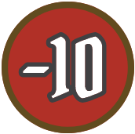</picture> cards
* five <picture>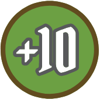</picture> cards
* one <picture>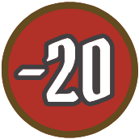</picture> cards
* one <picture>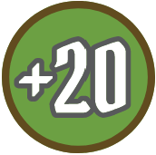</picture> cards
* one <picture></picture> cards
* one <picture></picture> cards

As the town guard gains perk marks and the party gains various other bonuses during the campaign, cards will be added to and removed from the town guard deck. Each card in the deck has a unique reference number.

Cards are drawn from the town guard deck when resolving attack events (see [p.60](#page_60)), much like how attack modifier cards are drawn when resolving attacks.

---

**
<a href="#page_1">🔝</a>&nbsp; &nbsp;<a name="page_57">57</a>
**

---

## Unlocking New Buildings

New buildings are unlocked through character retirement (see [p.64](#page_64)). Each new building has a corresponding sealed envelope, labeled with a two-digit number.

When a building is unlocked, you are free to open its envelope and inspect the contents. Shuffle any personal quests from the envelope into the personal quest deck. Take the "L0" sticker from the envelope and affix it to the lower half of the map board at the numbered position, matching up the artwork. **The unlocked building must still be built before the party can interact with it.**

Unlocked buildings often introduce new rules. Locate any rules stickers specified beneath the flap of the envelope and affix them to the pages of this rulebook in the corresponding sections, matching up the numbers. All building cards and other materials should be stored in the envelope until needed.

## Unlocking New Classes

New classes are unlocked through campaign progression. There are 11 new classes that can be unlocked. Each new class has two corresponding sealed tuck boxes, labeled with a class icon. When a class is unlocked, you are free to open its tuck boxes and inspect the contents, including the higher-level ability cards. That class is now available when a player creates a new character (see [p.65](#page_65)).

<table>
<tr>
<th colspan="4">Locked Class Icons</th>
</tr>
<tr>
<td><picture></picture></td><td><picture></picture></td><td><picture></picture></td><td><picture></picture></td>
</tr>
<tr>
<td><picture></picture></td><td><picture></picture></td><td><picture></picture></td><td><picture></picture></td>
</tr>
<tr>
<td><picture></picture></td><td><picture></picture></td><td><picture></picture></td><td></td>
</tr>
</table>

---

**
<a href="#page_1">🔝</a>&nbsp; &nbsp;<a name="page_58">58</a>
**

---

## Item Supplies

Items that are not in a character’s pool are split into two groups: the available supply and the unavailable supply. These two groups are kept separate in the game box with a divider card and are split further into subgroups of purchasable items and craftable items, depending on whether they have a gold cost or a crafting cost.

Items can be added to the available supply in the following ways:

* **Upgrading Buildings:** When the Craftsman or certain other buildings are upgraded, move the listed items from the unavailable supply to the corresponding available supply (either purchasable items or craftable items, depending on the building).

* **Crafting and Selling:** When a character spends an item to pay a crafting cost (see [p.65](#page_65)) or sells an item for gold (see [p.67](#page_67)), return the item to the corresponding available supply.

* **Retiring Characters:** When a character retires (see [p.64](#page_64)), return all of their items to the corresponding available supply.

* **Gaining Blueprints:** When the party gains an item blueprint, move all copies of that item from the unavailable supply to the available craftable supply.

* **Brewing Potions:** When the party brews a new potion (see [p.66](#page_66)), move all remaining copies of that item from the unavailable supply to the available craftable supply.

Access to certain items is limited, even once added to the available supply. Craftable items in the available supply can be gained by interacting with the Craftsman during the Downtime step, but purchasable items in the available supply can only be gained under specific conditions (e.g., creating a new character, reading certain sections, etc.).

Items are only returned to the unavailable supply when a game effect specifically instructs the party to do so.

#### Gloomhaven Items

If you own _Gloomhaven_, certain items from that game can cross over into _Frosthaven_ as options in the available purchasable supply, but only if those items are already available in _Gloomhaven_.

At the start of the _Frosthaven_ campaign, **only items 10, 25, 72, 105, 109, and 116 are available**, but other items will become available as buildings are constructed. _Gloomhaven_ solo items, however, can only be used by the corresponding class and should not be added to the available purchasable supply.

Some items from _Gloomhaven_ can be used to summon additional allies. Use the summon tokens from _Gloomhaven_ to track these additional summons. For the purposes of ability card effects, these additional summons are not considered to be owned by the character who summoned them (though they still act before the summoning character and use their attack modifier deck).

---

**
<a href="#page_1">🔝</a>&nbsp; &nbsp;<a name="page_59">59</a>
**

---

# Outpost Phase

After each Scenario Phase, the party must return to Frosthaven and perform an Outpost Phase except in the following situations:

* If the scenario was lost, the party may replay the scenario immediately (see [p.47](#page_47)).

* If the scenario has any linked scenarios available, the party may play one of the linked scenarios immediately. Some scenarios are force-linked, in which case the party must play the indicated linked scenario immediately (see [p.48](#page_48)).

The Outpost Phase involves spending time in Frosthaven to resolve events, acquire new items and abilities, and interact with buildings. Each Outpost Phase consists of five distinct steps:

1. **Passage of Time**
1. **Outpost Event**
1. **Building Operations**
1. **Downtime**
1. **Construction**

## 1. Passage of Time

At the start of the Outpost Phase, time passes. Mark the next unmarked box on the calendar to signify that one week has passed.

You will occasionally be instructed to add section numbers to future weeks on the calendar. Count the indicated number of weeks past the last marked box, then write the section number in that box. When you mark a box that contains a section number, immediately read the indicated section from the section book. If there are multiple section numbers, read those sections one at a time, in any order.

In some events and scenarios, time can pass outside of the Outpost Phase. When this happens, if you mark a box that contains a section number, do not read the indicated section immediately. Instead, write the section number in the next unmarked box, to be triggered when time passes during the next Outpost Phase.

When a set of 10 boxes on the calendar has been filled, a change of season occurs — either from summer to winter (filling the first half of a row) or from winter to summer (filling the second half of a row). The main difference between the two seasons is which deck will be used for road and outpost events.

---

**
<a href="#page_1">🔝</a>&nbsp; &nbsp;<a name="page_60">60</a>
**

---

## 2. Outpost Event

After the Passage of Time step, unless you were instructed not to resolve an outpost event this week, draw the top card of the active outpost event deck and resolve it. If the calendar shows summer, draw a summer outpost event. If the calendar shows winter, draw a winter outpost event. Outpost events are resolved exactly like road events (see [p.12](#page_12)).

### Attack Events

Attack events are special outpost events that require the party to defend Frosthaven from attack. During these attacks, buildings will be targeted and potentially damaged or even wrecked. The frequency of attacks is significantly higher in winter than in summer.

The attack is depicted on the back of the event card, below any outcomes from the choice presented on the front of the event card. These outcomes often modify the attack in some way. The back of the card contains the following:

* (A) **Attack Value:** This indicates the value that must be met or exceeded on a defense check to defend a targeted building.

* (B) **Target Value:** This indicates the total number of buildings targeted by the attack. The party must perform a separate defense check for each targeted building.

* (C) **Target Priority:** This indicates which non-wrecked buildings are targeted by the attack, and in what order, based on their reference numbers. If the attack has no target priority, the party decides. Each building can only be targeted once, even if the number of buildings within the target priority is lower than the target value.

---

**
<a href="#page_1">🔝</a>&nbsp; &nbsp;<a name="page_61">61</a>
**

---

### Defense Checks

When an attack occurs, the party must perform a defense check for each building targeted by the attack. For each defense check, draw a card from the town guard deck and add its bonus to Frosthaven’s total defense value (along with any modifiers from the event).

For any defense check, as long as the Barracks is not wrecked, the party can lose any number of soldiers before drawing to give the check advantage and reduce the attack value, based on the level of the Barracks and the number of soldiers lost. The defense check gains disadvantage if the Barracks is wrecked.

If the result meets or exceeds the attack value, the defense check succeeds and the building is defended. The defense check automatically succeeds when the "success" card is drawn and applied. Otherwise, the defense check fails and the building is damaged. For some attack events, the building is wrecked instead. The building is automatically wrecked when the "wrecked" card is drawn and applied.

Do not resolve any effects of buildings being damaged or wrecked during the attack until the entire attack event has fully resolved. Reshuffle the town guard deck after the attack and as needed during the attack if the deck is depleted.

### Damaged Buildings

<picture></picture>  When a building is damaged, the party must immediately pay the repair cost shown on its building card. This cost can be paid with material resources of any type from the Frosthaven supply or the characters’ personal supplies, in any combination. If the party cannot or does not want to pay this cost, they lose 1 morale instead.

### Wrecked Buildings

<picture></picture>  When a building is wrecked, flip its building card to the wrecked side. The wrecked effect of the building will then be resolved during the Building Operations step of every Outpost Phase until the building is rebuilt (see [p.68](#page_68)).

---

**
<a href="#page_1">🔝</a>&nbsp; &nbsp;<a name="page_62">62</a>
**

---

## 3. Building Operations

After the Outpost Event step, resolve the effects of all buildings. Go through the building deck in sequential order, one card at a time. For each building, resolve any normal or wrecked effect, which appears at the top of its card next to the <picture></picture> icon.

When the party gains or loses gold or resources due to these effects, they can be added to or taken from the Frosthaven supply or the characters’ personal supplies, in any combination. If a loss cannot be resolved fully, the party loses as much as possible, but there is no other penalty. However, some buildings have optional effects, with benefits that can only be gained if the associated cost is paid fully.

Because the Building Operations step occurs immediately after the Outpost Event step, any building that was wrecked during the outpost event will have its wrecked effect resolved once before the party even has an opportunity to rebuild it.

<h2 id="sticker-10" style="display: inline;">Sticker 10</h2>

### Garden

Once the Garden has been built, the party may spend any one herb resource during the Building Operations step to affix a matching sticker to any plot. The Garden starts with only one plot, but more plots become available at higher levels. Each plot can only have one sticker at a time, but any sticker can be covered by another sticker later.

The Garden will be harvested every two weeks (or every week at higher levels) when it is not wrecked. When the Garden is harvested, for each plot with a sticker, the party gains one matching herb resource. Do not remove the stickers.

When the Garden is upgraded to level 2, make sure to keep its card in the same orientation within the building deck.

## 4. Downtime

After the Building Operations step, characters may 
perform downtime activities in any order they would 
like. Many of these activities require characters to 
interact with a specific building, which they cannot do 
if the building is wrecked.

* **Level Up** [p.62](#page_62)
* **Retire a Character** [p.64](#page_64)
* **Create a Character** [p.65](#page_65)
* **Craft Items** [p.65](#page_65)
* **Brew Potions** [p.66](#page_66)
* **Sell Items** [p.67](#page_67)

## Sticker 11
## Sticker 12

### Level Up

If a character’s experience total is equal to or greater than the experience requirement of their next level, they must level up during the Downtime step. Leveling up has an experience requirement, as shown on the character sheet, but not an experience cost. A character’s experience total does not reset when they level up.

If a character’s level is lower than half the current prosperity level (rounded up), they may level up during the Downtime step without meeting the experience requirement, even multiple times, as long as their level does not exceed half the current prosperity level (rounded up). After they level up, set their experience total to match the experience requirement of their new level. This method of leveling up is optional, unlike leveling up through experience.

---

**
<a href="#page_1">🔝</a>&nbsp; &nbsp;<a name="page_63">63</a>
**

---

Leveling up can only be done during the Outpost Phase. Characters cannot level up during a scenario or even between scenarios if the party does not return to Frosthaven for an Outpost Phase (e.g., when the party attempts a linked scenario).

When a character levels up, they must do the following:

* **Add Ability Card:** Add one new ability card to their pool. The card they choose must match their class and must be of a level equal to or lower than their new level. For example, when a character reaches level 2, they can add one of their two level 2 ability cards. Then, when they reach level 3, they can add one of their two level 3 ability cards or their other level 2 ability card. This does not increase their maximum hand size, it simply increases the pool of cards available to them at the start of a scenario.

* **Increase Hit Points:** Increase their maximum hit point value. On the level track at the bottom of their character mat, the number printed in red below their new level indicates their new maximum hit point value.

* **Gain Perk Mark:** Gain one new perk mark <picture></picture>.The new perk mark is applied to the list on the right side of their character sheet by marking one corresponding box. Additional rules for gaining perks are outlined below.

#### Perks

Perks allow characters to fine-tune their attack modifier decks by adding and removing cards permanently. When a character gains a perk mark, they choose a perk from the perk list on the right side of their character sheet, mark the corresponding box, and resolve any change to their attack modifier deck. The effects of a perk are resolved as soon as the perk is gained, even when it is gained outside of the Downtime step.

The number of unlinked boxes shown next to a perk in the perk list indicates the maximum number of times that the perk can be gained, with each box requiring one perk mark. Some perks instead have multiple linked boxes, and all of these boxes must be filled with perk marks to gain the perk once.

The "ignore item <picture></picture> effects" perk only applies to the added <picture></picture> attack modifier cards denoted in the lower left corner of some items. The "ignore scenario effects" perk only applies to effects labeled as scenario effects in the scenario book. If a perk provides the character with any other benefit unrelated to their attack modifier deck, they can keep the relevant perk reminder card in their active area as a reminder.

Perk marks can be gained in four ways:

* **Leveling Up:** Each time a character levels up, they gain one perk mark.

* **Gaining Checkmarks:** Each time a character completes a set of three checkmarks, they gain one perk mark.

* **Creating Characters:** Each time a new character is created, they gain a number of perk marks equal to the number of characters previously retired by that player during the campaign.

* **Achieving Masteries:** Each time a character achieves a new mastery, they gain one perk mark.

Sometimes, a character will be instructed to lose checkmarks. However, perk marks cannot be lost, so checkmarks can only be lost back to the last complete set of three checkmarks. For example, if a character has eight checkmarks, it is possible for them to lose up to two checkmarks, but no more.

---

**
<a href="#page_1">🔝</a>&nbsp; &nbsp;<a name="page_64">64</a>
**

---

### Retire a Character

If a character has fulfilled the requirements of their personal quest, they must retire during the Downtime step, though they can perform all other downtime activities they would like to before doing so. Having achieved what they set out to do, they are no longer motivated to explore the monster-filled wilderness. Retired characters can no longer participate in the campaign with the rest of the party.

When a character retires, the completion of their personal quest gains the party 2 prosperity and unlocks the building envelope specified on the personal quest card. If a specified envelope is already unlocked, the alternate envelope is unlocked instead. If both envelopes are already unlocked, the party instead gains a random scenario (or 1 inspiration if that deck is depleted) and a random item blueprint (or 1 inspiration if that deck is depleted).

The retiring character may spend 15 inspiration once to draw two additional personal quests and choose one to complete immediately, without fulfilling its requirements, and shuffle the other back into the deck. This gains the party 2 more prosperity and unlocks another building envelope. The effects of completing two personal quests upon retirement are resolved simultaneously, so that they do not influence each other.

A personal quest card has the following:

* (A) **Title:** A thematic title for the quest.

* (B) **Description:** A short description of the quest.

* (C) **Requirements:** The specific requirements for completing the quest.

* (D) **Rewards:** The building envelope unlocked by completing the quest.

#### After Retirement

For each class, the first time a character of that class retires during the campaign, flip their character mat over and find the section number found near the bottom on the back side. After the retiring character has resolved the completion of their personal quest, read the indicated section from the section book.

As characters retire, record them in the retirement table on the campaign sheet, noting the character name, player name, and the other indicated information. When a new character is created, they gain one perk mark for each character previously retired by that player. If a single player is playing solo with multiple characters (see [p.69](#page_69)), count each character’s lineage separately for this purpose.

After a character retires, their personal quest is removed from the game, as well as any additional personal quest they completed upon retirement. Their character materials are put back in the corresponding tuck boxes. Their items are returned to the available supply, their resources are moved to the Frosthaven supply, and their gold is lost.

Retirement can only be done during the Downtime step. Characters cannot retire during a scenario or even between scenarios if the party does not return to Frosthaven for an Outpost Phase (e.g., when the party attempts a linked scenario).

---

**
<a href="#page_1">🔝</a>&nbsp; &nbsp;<a name="page_65">65</a>
**

---

### Create a Character

After a player retires their previous character, or if they simply wish to try something new, they can create a new character during the Downtime step.

If their previous character has not yet been retired, the player can either set the character aside to play again later or abandon the character. When set aside, their personal quest, items, gold, and resources are all kept. When abandoned, their personal quest is shuffled back into the deck, their items are returned to the available supply, their resources are moved to the Frosthaven supply, and their gold is lost.

When creating a character, a player may choose any class without an active character. This includes classes that have already been played during the campaign, as long as all previous characters of the chosen class have been retired or abandoned (not merely set aside). As the campaign progresses, new classes will be unlocked.

#### Initial Benefits

The new character draws two personal quests, choosing one to keep and shuffling the other back into the deck. It is possible for the personal quest deck to get depleted. When this happens, any new characters created during the campaign do not receive personal quests and therefore cannot ever be retired. Players can still set aside or abandon such characters whenever they wish, however.

The new character starts with (10 × P + 20) gold, where "P" is the current prosperity level. This starting gold must be spent immediately on items in the available purchasable supply. Any unspent remainder is lost.

The new character gains a number of perk marks equal to the number of characters previously retired by that player during the campaign.

#### Prosperity Leveling

Since a new character always starts at level 1, they may immediately level up without meeting the experience requirement, even multiple times, as long as their level does not exceed half the current prosperity level (rounded up). After they level up, set their experience total to match the experience requirement of their new level.

### Craft Items

Non-potion items can be crafted by interacting with the Craftsman building. Characters craft an item by spending the required resources or items. When paying crafting costs, material resources cannot be taken from the Frosthaven supply, but herb resources can. The crafting character gains one copy of the crafted item.

At the start of the campaign, only items 001–010 are available to be crafted. As the Craftsman gets upgraded and as the party discovers new item blueprints, more items will be added to the available craftable supply. Any item in the available craftable supply can be crafted.

When an item is required to craft another item, if all copies of the required item are owned by other members of the party, the crafting character may spend the gold, resources, or items listed as the required item’s cost in place of spending the item itself.

---

**
<a href="#page_1">🔝</a>&nbsp; &nbsp;<a name="page_66">66</a>
**

---

### Brew Potions

Potion items can be brewed by interacting with the Alchemist building. Characters brew a potion by spending any two herb resources, taken from the Frosthaven supply or their personal supply, in any combination. Refer to the combination of those two herbs on the alchemy chart to see which potion is brewed. The brewing character gains one copy of the brewed potion, which they may keep or immediately give to another member of the party.

At the start of the campaign, all windows on the alchemy chart are closed, so the potion formulas are unknown. The first time that a new combination is brewed during the campaign, open and tear off the corresponding window of the alchemy chart to reveal the potion. Once the potion has been revealed, the action cannot be undone. After the brewing character gains one copy of the brewed potion, move all remaining copies to the available craftable supply.

#### Alchemist: Level 2

Once the Alchemist has been upgraded to level 2, brewed potions can be distilled. Characters distill a potion by returning it from their pool of items to the available craftable supply. The distilling character gains any one of the herb resources required to brew the potion. If the same potion has been revealed in multiple windows of the alchemy chart, the distilling character can choose one herb resource from any of those potion formulas. Potions that have not yet been revealed on the alchemy chart cannot be distilled.

#### Alchemist: Level 3

Once the Alchemist has been upgraded to level 3, more powerful potions can be brewed by spending any three herb resources. These three-herb combinations each have their own window on the alchemy chart. All three-herb combinations brewed with two or more of the same herb resource create the same potion, which cannot be distilled.

---

**
<a href="#page_1">🔝</a>&nbsp; &nbsp;<a name="page_67">67</a>
**

---

### Sell Items

Items from a character’s pool can be sold during the Downtime step. When a character gains another copy of an item they already own, they must sell it immediately. When a character sells a purchasable item, they gain gold equal to half its gold cost (rounded down). When a character sells a craftable item, they gain 2 gold for each resource or item required to craft it. Return items to the corresponding available supply when sold.

### Purchase Items

Items cannot be purchased freely until building 37 is built. Until that happens, the items in the available purchasable supply can only be purchased with starting gold upon the creation of a new character or when a game effect specifically allows a character to do so.

## Sticker 13 (Cover "Purchase Items" Text Above)

## Sticker 14

---

**
<a href="#page_1">🔝</a>&nbsp; &nbsp;<a name="page_68">68</a>
**

---

## 5. Construction

After the Downtime step, the party may build, upgrade, and rebuild buildings. **They may build or upgrade one building by default, and they may lose 2 morale to build or upgrade a second building.** Buildings cannot be upgraded while wrecked. The party may also rebuild any number of wrecked buildings, but not until after any builds and upgrades.

Building and upgrading always has a prosperity requirement <picture></picture>. The build or upgrade can only be performed if the current prosperity level meets or exceeds the prosperity requirement of that build or upgrade, which is shown next to the build cost (on the map board) or upgrade cost (on the building card).

When a build or upgrade causes the prosperity level to increase, any character whose level is lower than half the new prosperity level (rounded up) may immediately level up without meeting the experience requirement, even multiple times, as long as their level does not exceed half the new prosperity level (rounded up). After they level up, set their experience total to match the experience requirement of their new level.

<h2 id="sticker-15" style="display: inline;">Sticker 15</h2>

### Carpenter

Once the Carpenter has been built, the cost to build, upgrade, or rebuild any building is reduced by any one material resource. Once the Carpenter has been upgraded to level 2, the party only loses 1 morale (not 2) if they wish to build or upgrade a second building during the Construction step. If the Carpenter is wrecked, these bonuses do not apply.

### Build

<picture>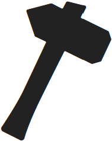</picture>  To build an unlocked building, the party must pay its build cost, which is shown on the building’s "L0" sticker (or printed directly on the map board itself in some cases) with resources from the Frosthaven supply.

When this cost is paid, cover it with the matching level 1 sticker and insert the matching level 1 card into the building deck in sequential order.

The party then gains the prosperity bonus and applies any other one-time effects indicated on the building card. During the next Outpost Phase, the building’s normal effect will resolve and its interactions will be available (unless it gets wrecked).

### Upgrade

<picture></picture>  To upgrade an existing building, the party must pay its upgrade cost, which is shown on the normal side of the current building card, with resources from the Frosthaven supply.

When this cost is paid, cover the old sticker with the one for the next level and replace the old card in the building deck with the one for the next level.

The party then gains the prosperity bonus and applies any other one-time effects indicated on the new building card.

### Rebuild

<picture></picture>  To rebuild a wrecked building, the party must pay the rebuild cost, which is shown on the wrecked side of the building card, with resources from the Frosthaven supply.

When this cost is paid, flip the building card back over to its normal side within the building deck.

During the next Outpost Phase, the building’s normal effect will resolve and its interactions will be available again (unless it gets wrecked).

---

**
<a href="#page_1">🔝</a>&nbsp; &nbsp;<a name="page_69">69</a>
**

---

# Game Variants

### Casual Mode

In casual mode, the party can play any unlocked scenario, regardless of its requirements. When a scenario is played in casual mode, all campaign effects are ignored. No event is resolved, time does not pass, and the party does not gain any experience, loot, treasures, checkmarks, personal quest progress, rewards, unlockables, etc. The outcome of the scenario has no impact on the campaign. However, completed scenarios can be replayed as part of the campaign (i.e., not in casual mode) as long as the party still meets their requirements.

### Crossover Classes

Any unlocked class from another _Gloomhaven_ game can be chosen when creating a new character in _Frosthaven_.Conversely, any unlocked class from _Frosthaven_ can be chosen when creating a new character in another _Gloomhaven_ game. Classes may keep all of their previous enhancements, but doing so might cause imbalance. New character sheets for these crossover classes, which include traits and other useful additions, are available at [cephalofair.com/frosthaven](https://cephalofair.com/frosthaven).

### Temporary Enhancements

With this variant, enhancement stickers are removed when a character retires. This can be facilitated by affixing the stickers to card sleeves, instead of directly to the ability cards, or by applying reusable stickers (which are sold separately). Temporary enhancements have a reduced cost: First, calculate the normal enhancement cost, including any discounts. Next, if the action has at least one previous enhancement, reduce the cost by 20 gold. Finally, reduce the cost by 20 percent (rounded up).

### Reduced Randomness

With this variant, parties who want less randomness can reduce the range of outcomes caused by attack modifier cards. Treat all <picture></picture> and <picture></picture> cards as <picture></picture> cards instead, and treat all <picture></picture> and <picture></picture> cards as <picture></picture> cards instead. Even though these cards no longer have the same modifiers, the effect of the shuffle icon still applies. Any item effects or other game effects that refer to <picture></picture> or <picture></picture> cards are unaffected.

### Solo Mode

A single player can play solo by controlling two or more characters. Because playing solo reduces uncertainty and makes coordination easier, increase the difficulty by calculating the scenario level differently for solo mode. Take the average level of all characters in the scenario, then add 1 before dividing by 2 and rounding up. For example, on recommended difficulty with three level 4 characters, the scenario level would be ((4 + 4 + 4) ÷ 3 ÷ 2) = 2, but in solo mode it would be ((((4 + 4 + 4) ÷ 3) + 1) ÷ 2) = 3.

### Open Information

With this variant, parties who want fewer restrictions can share exactly which cards they have in hand and discuss specific details about their plans during card selection, which is normally disallowed by the limits on communication. This is not the recommended way to play the game, but some parties may prefer this play style. Because playing with open information reduces uncertainty and makes coordination easier, increase the difficulty by calculating the scenario level as you would for solo mode.

---

**
<a href="#page_1">🔝</a>&nbsp; &nbsp;<a name="page_70">70</a>
**

---

### Permanent Death

With this variant, the specter of death looms large for parties who want higher stakes. When a character drops to zero hit points, they die instead of becoming exhausted. Characters can still become exhausted if unable to play two cards or perform a long rest, but they survive and can still participate in future scenarios, even if the current scenario is lost.

When a character dies, they are removed from the campaign at the end of the current scenario. Their personal quest is shuffled back into the deck. Their character materials are put back in the corresponding tuck boxes. Their items are returned to the available supply, their resources are moved to the Frosthaven supply, and their gold is lost. The player whose character died must create a new character during the Downtime step of the next Outpost Phase (or, if the next scenario is force-linked, immediately before the scenario begins).

When a character becomes exhausted, all normal exhaustion effects still occur, except their figure now remains on the map and can still be targeted by monster attacks and other abilities. Exhausted characters still cannot act in any way, and they are considered to have initiative 99 for the purpose of focusing.

### Character Respeccing

With this variant, parties who want more flexible characters can pay to change their builds. During the Downtime step of the Outpost Phase, any character may spend gold equal to 10 times their current level in order to respec. This allows them to reset all of their previous ability card choices. When a character respecs, they return all ability cards from their pool that are not level 1 or level X, then make a new choice at each level, following the normal rules for leveling up, until they reach their current level.

### Random Dungeons

With this variant, the party can attempt a random dungeon instead of an official scenario, either as part of the ongoing campaign or as a one-off session in casual mode. In either case, no road event is resolved beforehand.

Each random dungeon has three randomly generated rooms, and the party must clear the monsters from all three rooms in order to complete it. These rooms are revealed one at a time, with each new room only revealed when a character opens the door. Generate each room by drawing a random room card and a random setup card.

Build the loot deck with 24 cards: 12 money cards, two cards of each material resource, and one card of each herb resource.

#### Random Room Card

A random room card contains the following:

* (A) **Noun Title:** A noun title. When combined with the adjective title from the random setup card, this creates the full title of the room.

* (B) **Map Tiles:** The map tiles for the room. Any required overlay tiles will be shown, as well as 12 map designations for the placement of various features shown on the random setup card. If the overlay tiles of a specific type run out by the second or third room, use any comparable overlay tiles instead.

* (C) **Entrance and Exit Locations:** The locations of the entrances and exits to the room. These always correspond to the closest border hex of the map tile with a puzzle connection. In the first room, each character starts on any empty hex within two hexes of the entrance. If the first room has two entrances, the party must choose only one.

* (D) **Entrance and Exit Types:** The types of the entrances and exits to the room. These are labeled "A" or "B." When a room has two exits, the party must choose only one. When a room has two entrances, the party must use the entrance that matches their chosen exit from the previous room. If the back of the next room card does not show a matching entrance, discard until a card with a matching entrance appears.

---

**
<a href="#page_1">🔝</a>&nbsp; &nbsp;<a name="page_71">71</a>
**

---

* (E) **Penalties:** The penalties for revealing the room. For recommended difficulty, apply no penalty for the first room, the minor penalty for the second room, and the major penalty for the third room. The party can scale the difficulty as they wish by adjusting the number and severity of these penalties. If the penalty of the first room refers to the character who opened the door, the party can decide who it applies to.

#### Random Setup Card

A random setup card contains the following:

* (A) **Adjective Title:** An adjective title. When combined with the noun title from the random room card, this creates the full title of the room.

* (B) **Setup Features:** A list of monsters, tiles, and tokens in the room. Place these features in their indicated hexes in the room by referencing the 12 map designations shown on the random room card. As in the normal setup for a scenario, the placement and rank of monsters is based on the number of characters in the party.

* (C) **Elemental Infusion:** When this room is revealed, infuse any depicted element at the end of the current turn.

* (D) **Treasure Contents:** The contents of any treasure tiles in the room. Specific loot that is important to the campaign will never appear in a random dungeon.

* (E) **Trap Types:** The types of any traps in the room.

---

**
<a href="#page_1">🔝</a>&nbsp; &nbsp;<a name="page_72">72</a>
**

---

# Appendix A: Component Inventory

* **1** map board
* **1** rulebook
* **1** scenario book
* **1** section book
* **1** setup guide
* **1** alchemy chart
* **1** pad of campaign sheets
* **38** map tiles
* **6** sticker sheets
* **1** sealed puzzle book
* **5** scenario flowcharts
* **225** overlay tiles
* **327** monster standees
* **17** sealed envelopes
* **1** element board with **1** round marker and **6** element tokens
* **18** small tuck boxes containing character miniatures

> <picture></picture> **Hidden Content?** Envelope contents are not included in this inventory. For a complete list of these contents, visit [cephalofair.com/frosthaven](https://cephalofair.com/frosthaven)

---

**
<a href="#page_1">🔝</a>&nbsp; &nbsp;<a name="page_73">73</a>
**

---

> **17 Large Tuck Boxes (6 Unsealed, 11 Sealed)**
> **17** Character mats
> **503** character ability cards
> **18** character standees
> **85** character tokens
> **30** special character tokens
> **45** character summon standees
> **303** character attack modifier cards
> **51** perk reminder cards
> **17** character initiative order tokens
> **17** pads of character sheets

**4** reference cards
**29** building cards
**10** personal quest cards
**24** random room cards
**24** random setup cards
**247** event cards
**379** item cards
**25** random item cards
**15** random item blueprint cards
**60** battle goal cards
**59** loot cards
**7** random scenario cards
**45** challenge cards
**344** monster ability cards
**55** town guard cards
**165** attack modifier cards
**13** divider cards
**32** boss stat cards
**48** monster stat cards
**6** monster stat sleeves
**4** character dials
**49** monster initiative order tokens
**25** scenario aid tokens
**30+** plastic bases
**1** token tray with lid
**1** tile tray with lid
**2** card trays
**60+** damage tokens
**20+** loot tokens
**100+** condition tokens

> **Missing parts?**
> If you discover that you are missing any parts from your game, you can request replacements at [cephalofair.com/contact](https://cephalofair.com/contact).

---

**
<a href="#page_1">🔝</a>&nbsp; &nbsp;<a name="page_74">74</a>
**

---

# Appendix B: Monster Turn Guide

## 1. Initial Check

1. Check for Conditions and Attack Ability

    * Any monster with <picture></picture> or without an attack ability finds a focus and moves as if for a single-target melee attack.

    * Any monster with <picture></picture> ignores all move abilities.

    * Any monster with <picture></picture> cannot find a focus, will not move, and ignores all abilities.

2. Check for Movement Paths Check for movement paths to attack hexes (i.e., hexes from which an attack can be performed).These hexes are shown with the <picture></picture> icon in diagrams. If no path exists, the monster cannot find a focus and will not move or attack.

## 2. Find Focus

The monster finds an attack hex and focuses on an enemy with the following priority list:

1. A hex with a movement path that triggers fewer negative hexes.
1. A hex with a movement path that requires fewer movement points.
1. An enemy closer by range.
1. An enemy earlier in the initiative order, following the normal rules for breaking tiesfor initiative (see [p.19](#page_19)).

---

**
<a href="#page_1">🔝</a>&nbsp; &nbsp;<a name="page_75">75</a>
**

---

## 3. Perform Monster Abilities

The monster performs all of its abilities from top to bottom (move, attack, and other abilities). For move abilities, observe the following rules: 

* (A) The monster must end its movement with a shorter path to its attack hex than it had before or else it will not move.
* (B) The monster chooses a movement path that triggers the fewest negative hexes.
* (C) The monster moves to an attack hex from which it can attack its focus. If it can target multiple enemies, it instead moves to a hex from which it can attack its focus and the most other enemies.
* (D) The monster moves to a hex from which it can attack the most possible targets (including its focus) with the fewest possible disadvantaged attacks.
* (E) If the monster could move to multiple hexes that maximize the previous priorities, it moves to the hex that requires the fewest movement points.
* (F) In cases where monster movement is still ambiguous, the party decides.

---

**
<a href="#page_1">🔝</a>&nbsp; &nbsp;<a name="page_76">76</a>
**

---

# Appendix C: Important Reminders

### Attacks and Damage

* A separate attack modifier card is drawn for each target of an attack ability.
* A shield bonus only reduces damage from attacks, not from other sources, but the bonus applies to all incoming attacks while active.
* Even if an attack deals no damage (e.g., when a <picture></picture> card is drawn), all added effects of the attack are still applied.
* A character can negate all damage from one source by losing one card from their hand or two cards from their discard pile.

### Bless and Curse

* When there are two opposing sides for the monsters in a scenario, they use two different attack modifier decks (<picture></picture> and <picture></picture>) and thus are affected by bless and curse separately.
* Immunity to curse prevents a figure from adding a curse card to their deck, but does not prevent a drawn curse card from taking effect.
* Bless and curse cards are returned to the supply once resolved, instead of placed in the discard pile. They are removed from all decks at the end of each scenario.

### Monsters

* A monster ability card is drawn each round for each set of monsters on the map. All monsters of a single set will use the same ability card.
* A monster only performs the abilities listed on its ability card for the round.
* A monster does not apply any active bonuses from its ability card until its turn.
* If a monster cannot find a focus, it will not move.
* If a monster will not be performing an attack on its turn, or has disarm, it finds a focus as if for a single-target melee attack.

### Characters

* Characters initially use 20-card starting decks of attack modifier cards, labeled <picture></picture>, <picture></picture>, <picture></picture>, <picture></picture>. Advanced attack modifier cards are only added by gaining perks.
* A character cannot perform two top actions or two bottom actions. For the basic actions, "<picture></picture> **2**" is always a top action, and "<picture></picture> **2**" is always a bottom action.
* Exhaustion does not reduce the number of characters in the scenario, for variables like monster hit points or scenario effects.

### Summons

* Summons must be placed in empty hexes adjacent to the summoner. If there is no adjacent hex available, the figure is not summoned.
* Summons are not directly controlled by their summoner. Most summons instead obey automated monster rules.

### Loot and Elements

* All monsters, except scenario allies, drop a loot token when they die.
* All characters loot the hex they occupy at the end of their turn, not the end of each movement. Monsters and summons do not perform end-of-turn looting.
* Since infusions don’t occur until the end of the turn, any consumed element must be already strong or waning at the start of the turn, prior to any infusions.

### Scenario Details

* The recommended scenario level is half the average character level (rounded up).
* Characters can each bring into a scenario a number of small items equal to half their level (rounded up).
* The end of a scenario can only occur at the end of a round.

---

**
<a href="#page_1">🔝</a>&nbsp; &nbsp;<a name="page_77">77</a>
**

---

# Appendix D: Enhancement Costs

> **Stop! Do not read this appendix until building 44 is built.**

Each type of enhancement has a base cost, which is determined by the following cost chart. The cost might then be modified based on which ability is being enhanced. If applicable, apply the following cost modifiers, one at a time, in order:

1. If the ability targets multiple figures or tiles, double the cost. This applies to abilities that summon or affect multiple allies or tokens and to abilities that can target multiple figures or tiles. This does not apply to target, area-of-effect hex, or element enhancements.

2. If the action has a lost icon, but no persistent icon, halve the cost.

3. If the ability provides a persistent bonus, whether or not the action has a lost icon, triple the cost. This does not apply to summon stat enhancements.

4. For each level of the ability card above level 1, add 25 gold to the cost.

5. For each enhancement already on the action, add 75 gold to the cost.

Some enhancements do not fall neatly into the categories on the cost chart. When determining their base cost, treat damage traps as "<picture></picture> **+1**" enhancements (50 gold), treat healing traps as "<picture></picture> **+1**" enhancements (30 gold), and treat the movement of tokens and tiles as "<picture></picture> **+1**" enhancements (30 gold).

|Enhancement|Base Cost|
|:-:|:-:|
|**Move +1**|30 Gold| 
|**Attack +1**|50 Gold| 
|**Range +1**|30 Gold| 
|**Target +1**|75 Gold| 
|**Shield +1**|80 Gold| 
|**Retaliate +1**|60 Gold| 
|**Pierce +1**|30 Gold| 
|**Heal +1**|30 Gold| 
|**Push +1**|30 Gold| 
|**Pull +1**|20 Gold| 
|**Teleport +1**|50 Gold| 
|**Summon HP +1**|40 Gold| 
|**Summon Move +1**|60 Gold| 
|**Summon Attack +1**|100 Gold| 
|**Summon Range +1**|50 Gold| 
|**Regenerate**|40 Gold| 
|**Ward**|75 Gold| 
|**Strengthen**|100 Gold| 
|**Bless**|75 Gold| 
|**Wound**|75 Gold| 
|**Poison**|50 Gold| 
|**Immobilize**|150 Gold| 
|**Muddle**|40 Gold| 
|**Curse**|150 Gold| 
|**Element**|100 Gold| 
|**Wild Element**|150 Gold| 
|**Jump**|60 Gold| 
|**Area-of-Effect Hex**|200 Gold divided by the number of existing hexes (rounded up)|

---

**
<a href="#page_1">🔝</a>&nbsp; &nbsp;<a name="page_78">78</a>
**

---

# Appendix E: Treasure Index

_Skipped due to spoilers_

---

**
<a href="#page_1">🔝</a>&nbsp; &nbsp;<a name="page_79">79</a>
**

---

# Appendix F: Favors

_Skipped due to spoilers_

---

**
<a href="#page_1">🔝</a>&nbsp; &nbsp;<a name="page_80">80</a>
**

---

# Appendix G: Index

## A
Ability [10](#page_10), [14](#page_14), ***[20](#page_20)***, [21](#page_21)–[43](#page_43), [45](#page_45), [74](#page_74)–[76](#page_76) 
Ability card (character) [5](#page_5), [8](#page_8), [18](#page_18)–[20](#page_20), [30](#page_30), ***[34](#page_34)***, [46](#page_46), [63](#page_63), [70](#page_70), [76](#page_76) 
Ability card (monster) [8](#page_8), [19](#page_19)–[20](#page_20), [39](#page_39), ***[40](#page_40)***, [41](#page_41)–[44](#page_44), [46](#page_46), [74](#page_74)–[76](#page_76) 
Action ***[20](#page_20)***, [23](#page_23), [25](#page_25), [30](#page_30), [34](#page_34), [37](#page_37)–[38](#page_38), [46](#page_46), [76](#page_76) 
Active area ***[30](#page_30)***, [31](#page_31), [34](#page_34), [37](#page_37)–[38](#page_38), [46](#page_46), [63](#page_63) 
Active bonus ***[30](#page_30)–[31](#page_31)***, [38](#page_38) 
Added effect ***[22](#page_22)***, [23](#page_23)–[24](#page_24), [26](#page_26)–[28](#page_28), [32](#page_32) 
Adjacent [13](#page_13)–[14](#page_14), ***[21](#page_21)***, [25](#page_25), [27](#page_27), [31](#page_31), [42](#page_42)–[43](#page_43), [46](#page_46), [76](#page_76) 
Advantage ***[27](#page_27)***, [28](#page_28), [61](#page_61) 
Alchemist [52](#page_52), ***[66](#page_66)*** 
Alchemy chart ***[66](#page_66)*** 
Area of effect ***[22](#page_22)*** 
Arrowvine [16](#page_16), ***[56](#page_56)*** 
Attack (ability) [21](#page_21), ***[25](#page_25)***, [26](#page_26)–[29](#page_29), [33](#page_33)–[34](#page_34), [36](#page_36), [39](#page_39)–[42](#page_42), [74](#page_74)–[76](#page_76) 
Attack (event) [54](#page_54), ***[60](#page_60)***, [61](#page_61) 
Attack modifier card [5](#page_5), [8](#page_8), [20](#page_20), [22](#page_22), ***[25](#page_25)–[26](#page_26)***, [27](#page_27)–[29](#page_29), [31](#page_31), [33](#page_33), [35](#page_35)–[36](#page_36), [46](#page_46)–[47](#page_47), [63](#page_63), [69](#page_69), [76](#page_76) 
Axenut [16](#page_16), [56](#page_56) 

## B
Bane ***[29](#page_29)***, [45](#page_45) 
Barracks [52](#page_52), [54](#page_54), ***[61](#page_61)*** 
Basic action ***[34](#page_34)***, [76](#page_76) 
Battle goal [8](#page_8), ***[17](#page_17)***, [47](#page_47)–[48](#page_48) 
Bless [8](#page_8), [26](#page_26), ***[28](#page_28)***, [47](#page_47), [69](#page_69), [76](#page_76) 
Blueprint [15](#page_15), [32](#page_32), [48](#page_48), ***[58](#page_58)***, [64](#page_64) 
Body (item) ***[35](#page_35)*** 
Boss ***[45](#page_45)*** 
Boss special ***[45](#page_45)*** 
Brittle [25](#page_25), [28](#page_28), ***[29](#page_29)***, [32](#page_32), [38](#page_38) 
Build [50](#page_50), [52](#page_52), [54](#page_54), [57](#page_57), ***[68](#page_68)*** 
Building [50](#page_50), ***[52](#page_52)***, [54](#page_54), [57](#page_57)–[58](#page_58), [60](#page_60)–[62](#page_62), [64](#page_64)–[68](#page_68) 
Building card ***[52](#page_52)***, [61](#page_61)–[62](#page_62), [68](#page_68) 
Building operations [52](#page_52), [59](#page_59), [61](#page_61), ***[62](#page_62)*** 

## C
C (equations) [45](#page_45), ***[46](#page_46)*** 
Calendar [12](#page_12), [54](#page_54)–[55](#page_55), ***[59](#page_59)*** 
Campaign [3](#page_3), [7](#page_7), [12](#page_12), [48](#page_48)–[49](#page_49), ***[50](#page_50)***, [51](#page_51)–[52](#page_52), [54](#page_54)–[58](#page_58), [64](#page_64)–[66](#page_66), [69](#page_69)–[71](#page_71) 
Campaign sheet [12](#page_12), [48](#page_48), [50](#page_50), ***[54](#page_54)–[55](#page_55)***, [59](#page_59), [61](#page_61), [64](#page_64) 
Card selection ***[18](#page_18)***, [38](#page_38), [69](#page_69) 
Character [3](#page_3), ***[4](#page_4)–[6](#page_6)***, [8](#page_8), [12](#page_12), [14](#page_14), [17](#page_17)–[20](#page_20), [22](#page_22), [26](#page_26)–[38](#page_38), [46](#page_46)–[48](#page_48), [53](#page_53), [56](#page_56)–[58](#page_58), [62](#page_62)–[71](#page_71), [76](#page_76) 
Character dial ***[5](#page_5)***, [8](#page_8), [29](#page_29), [37](#page_37)–[38](#page_38), [47](#page_47) 
Character mat ***[4](#page_4)***, [8](#page_8), [12](#page_12), [28](#page_28), [34](#page_34)–[35](#page_35), [63](#page_63)–[64](#page_64) 
Character sheet [4](#page_4), [47](#page_47)–[48](#page_48), ***[53](#page_53)***, [62](#page_62)–[63](#page_63), [65](#page_65) 
Character token ***[4](#page_4)***, [30](#page_30), [36](#page_36)–[37](#page_37) 
Checkmark [17](#page_17), [48](#page_48), ***[53](#page_53)***, [55](#page_55), [63](#page_63) 
Class (character) ***[3](#page_3)***, [4](#page_4)–[6](#page_6), [26](#page_26), [53](#page_53), [57](#page_57), [63](#page_63)–[65](#page_65), [69](#page_69) 
Commanding figures ***[33](#page_33)*** 
Completed (scenario) [3](#page_3), [7](#page_7)–[8](#page_8), [10](#page_10), [17](#page_17), [47](#page_47), ***[48](#page_48)***, [50](#page_50), [69](#page_69)  
Complexity [3](#page_3), ***[10](#page_10)*** 
Conclusion (scenario) [10](#page_10), ***[48](#page_48)*** 
Condition [14](#page_14)–[15](#page_15), [21](#page_21), [26](#page_26), ***[28](#page_28)–[29](#page_29)***, [33](#page_33), [38](#page_38)–[39](#page_39), [43](#page_43), [45](#page_45), [47](#page_47), [76](#page_76) 
Construction [59](#page_59), ***[68](#page_68)*** 
Consume (element) [22](#page_22), ***[23](#page_23)***, [43](#page_43), [76](#page_76) 
Control [32](#page_32), ***[33](#page_33)*** 
Corpsecap [16](#page_16), ***[56](#page_56)*** 
Corridor [13](#page_13), ***[14](#page_14)*** 
Craftsman [52](#page_52), [58](#page_58), ***[65](#page_65)*** 
Create (character) [4](#page_4)–[6](#page_6), [57](#page_57), [62](#page_62)–[64](#page_64), ***[65](#page_65)***, [69](#page_69), [70](#page_70) 
Create (tile) ***[33](#page_33)*** 
Curse [26](#page_26), [28](#page_28), ***[29](#page_29)***, [76](#page_76) 

## D
Damage [14](#page_14)–[16](#page_16), [25](#page_25)–[26](#page_26), [28](#page_28)–[29](#page_29), [31](#page_31)–[32](#page_32), ***[38](#page_38)***, [39](#page_39), ***[45](#page_45)***, [76](#page_76) 
Damaged (building) [52](#page_52), [60](#page_60), ***[61](#page_61)*** 
Dead [39](#page_39), ***[45](#page_45)***, [70](#page_70), [76](#page_76) 
Defense [54](#page_54), [60](#page_60), ***[61](#page_61)*** 
Destroy (tile) ***[33](#page_33)*** 
Difficult terrain ***[14](#page_14)***, [24](#page_24), [32](#page_32), [41](#page_41) 
Difficulty ***[16](#page_16)***, [69](#page_69), [71](#page_71) 
Disadvantage ***[27](#page_27)***, [29](#page_29), [42](#page_42), [61](#page_61), [75](#page_75) 
Disarm ***[29](#page_29)***, [41](#page_41), [76](#page_76) 
Discard [8](#page_8), [18](#page_18), [25](#page_25)–[26](#page_26), [29](#page_29)–[31](#page_31), [33](#page_33), ***[34](#page_34)***, [38](#page_38), [40](#page_40), [46](#page_46)–[47](#page_47), [76](#page_76) 
Distill ***[66](#page_66)*** 
Door ***[14](#page_14)***, [24](#page_24), [70](#page_70)–[71](#page_71) 
Downtime [52](#page_52), [58](#page_58)–[59](#page_59), ***[62](#page_62)***, [63](#page_63)–[67](#page_67), [70](#page_70) 

## E
Element [22](#page_22), ***[23](#page_23)***, [26](#page_26), [37](#page_37), [43](#page_43), [46](#page_46), [71](#page_71), [76](#page_76) 
Elite (monster) [11](#page_11), [19](#page_19), ***[39](#page_39)***, [40](#page_40), [42](#page_42), [44](#page_44), [46](#page_46) 
Empty (hex) ***[13](#page_13)***, [14](#page_14), [31](#page_31), [43](#page_43)–[44](#page_44), [46](#page_46), [70](#page_70), [76](#page_76) 
End of round [18](#page_18), [38](#page_38), ***[46](#page_46)*** 
End-of-turn looting ***[37](#page_37)***, [43](#page_43) 
Enemy ***[21](#page_21)***, [22](#page_22), [24](#page_24)–[25](#page_25), [27](#page_27)–[28](#page_28), [33](#page_33), [41](#page_41)–[44](#page_44), [74](#page_74)–[75](#page_75) 
Envelope [50](#page_50), ***[57](#page_57)***, [64](#page_64) 
Escape ***[46](#page_46)*** 
Event [8](#page_8), ***[12](#page_12)***, [47](#page_47), [54](#page_54), [60](#page_60), [61](#page_61)–[62](#page_62), [69](#page_69)–[70](#page_70) 
Exhaust [28](#page_28), [31](#page_31)–[32](#page_32), ***[38](#page_38)***, [42](#page_42), [48](#page_48), [70](#page_70), [76](#page_76) 
Experience [5](#page_5), [8](#page_8), [16](#page_16), [30](#page_30), ***[37](#page_37)***, [47](#page_47)–[48](#page_48), [53](#page_53), [62](#page_62), [65](#page_65), [68](#page_68)–[69](#page_69) 

## F
Featureless (hex) ***[13](#page_13)***, [33](#page_33) 
Feet (item) ***[35](#page_35)*** 
Figure ***[7](#page_7)***, [11](#page_11), [13](#page_13)–[15](#page_15), [19](#page_19)–[26](#page_26), [28](#page_28)–[33](#page_33), [37](#page_37)–[38](#page_38), [40](#page_40), [44](#page_44)–[46](#page_46), [70](#page_70), [76](#page_76) 
Flamefruit [16](#page_16), ***[56](#page_56)*** 
Flip (item) ***[36](#page_36)*** 
Flying [14](#page_14)–[15](#page_15), ***[24](#page_24)***, [32](#page_32) 
Focus [31](#page_31), ***[41](#page_41)***, [42](#page_42)–[43](#page_43), [46](#page_46), [74](#page_74)–[76](#page_76) 
Force-linked (scenario) ***[48](#page_48)***, [59](#page_59), [70](#page_70) 
Forced movement [14](#page_14)–[15](#page_15), [21](#page_21), [26](#page_26), ***[32](#page_32)***, [33](#page_33), [45](#page_45) 
Frosthaven supply ***[54](#page_54)***, [56](#page_56), [61](#page_61)–[62](#page_62), [64](#page_64)–[66](#page_66), [68](#page_68), [70](#page_70) 

## G
Geographical feature ***[10](#page_10)***, [51](#page_51) 
Gloomhaven [6](#page_6), [49](#page_49), [58](#page_58), [69](#page_69) 
Goal (scenario) ***[10](#page_10)***, [15](#page_15), [44](#page_44), [47](#page_47)–[48](#page_48) 
Gold [4](#page_4), [6](#page_6), [12](#page_12), ***[16](#page_16)***, [35](#page_35)–[36](#page_36), [47](#page_47)–[48](#page_48), [53](#page_53), [58](#page_58), [62](#page_62), [64](#page_64)–[65](#page_65), [67](#page_67), [70](#page_70) 
Grant (ability) ***[33](#page_33)*** 

## H
H (equations) ***[46](#page_46)*** 
Hand (item) ***[35](#page_35)*** 
Hand (of cards) [5](#page_5), [8](#page_8), [18](#page_18), [30](#page_30), [33](#page_33), ***[34](#page_34)***, [38](#page_38), [63](#page_63), [76](#page_76) 
Hand size ***[4](#page_4)***, [5](#page_5), [8](#page_8), [63](#page_63) 
Hazardous terrain ***[14](#page_14)***, [16](#page_16), [24](#page_24), [33](#page_33), [41](#page_41) 
Head (item) ***[35](#page_35)*** 
Heal (ability) [21](#page_21), [26](#page_26), [28](#page_28), ***[29](#page_29)***, [38](#page_38), [43](#page_43) 
Herb resource [16](#page_16), [54](#page_54), ***[56](#page_56)***, [65](#page_65)–[66](#page_66), [70](#page_70) 
Hex [11](#page_11), ***[13](#page_13)***, [14](#page_14)–[15](#page_15), [21](#page_21)–[22](#page_22), [24](#page_24), [28](#page_28), [31](#page_31)–[33](#page_33), [37](#page_37), [41](#page_41)–[46](#page_46), [70](#page_70)–[71](#page_71), [74](#page_74)–[76](#page_76) 
Hide [16](#page_16), ***[56](#page_56)*** 
Hit point [4](#page_4)–[5](#page_5), [8](#page_8), [15](#page_15), [29](#page_29), [31](#page_31), ***[38](#page_38)–[39](#page_39)***, [43](#page_43), [45](#page_45)–[47](#page_47), [63](#page_63) 

## I
Icy terrain ***[14](#page_14)***, [24](#page_24), [41](#page_41) 
Immobilize [24](#page_24), ***[29](#page_29)*** 
Immune [15](#page_15), [28](#page_28)–[29](#page_29), ***[39](#page_39)***, [45](#page_45), [76](#page_76) 
Impair ***[29](#page_29)*** 
Inert (element) ***[23](#page_23)***, [46](#page_46) 
Infuse (element) ***[23](#page_23)***, [43](#page_43), [71](#page_71) 
Initiative [15](#page_15), [18](#page_18), ***[19](#page_19)***, [31](#page_31), [34](#page_34), [38](#page_38)–[41](#page_41), [43](#page_43)–[44](#page_44), [70](#page_70), [74](#page_74) 
Initiative order token ***[4](#page_4)***, [8](#page_8), [19](#page_19), [39](#page_39), [44](#page_44) 
Inspiration [15](#page_15), [48](#page_48), ***[54](#page_54)***, [64](#page_64) 
Introduction (scenario) [8](#page_8), ***[10](#page_10)*** 
Invisible ***[28](#page_28)*** 
Item [8](#page_8), [15](#page_15)–[16](#page_16), [32](#page_32), ***[35](#page_35)–[36](#page_36)***, [48](#page_48), [58](#page_58), [63](#page_63)–[67](#page_67), [69](#page_69) 

## J
Jump [14](#page_14)–[15](#page_15), ***[24](#page_24)*** 

## K
Kill credit ***[45](#page_45)*** 

## L
L (equations) ***[46](#page_46)*** 
Level (character) [4](#page_4)–[6](#page_6), [8](#page_8), [16](#page_16), [34](#page_34)–[35](#page_35), [37](#page_37), [53](#page_53), ***[62](#page_62)–[63](#page_63)***, [65](#page_65), [68](#page_68), [70](#page_70), [76](#page_76) 
Level (scenario) [6](#page_6), [14](#page_14)–[15](#page_15), ***[16](#page_16)***, [39](#page_39), [46](#page_46)–[47](#page_47), [69](#page_69), [76](#page_76) 
Level up [37](#page_37), ***[62](#page_62)–[63](#page_63)***, [65](#page_65), [68](#page_68) 
Line-of-sight ***[21](#page_21)***, [22](#page_22), [41](#page_41) 
Linked (scenario) ***[48](#page_48)***, [51](#page_51), [59](#page_59), [70](#page_70) 
Linked (hexes) ***[46](#page_46)*** 
Locked (door) ***[46](#page_46)*** 
Long rest [18](#page_18)–[19](#page_19), [29](#page_29), [34](#page_34), [36](#page_36), ***[38](#page_38)***, [70](#page_70) 
Loot (ability) [15](#page_15)–[16](#page_16), ***[32](#page_32)***, [37](#page_37), [43](#page_43), [76](#page_76) 

---

**
<a href="#page_1">🔝</a>&nbsp; &nbsp;<a name="page_81">81</a>
**

---

Loot card [8](#page_8), [10](#page_10), ***[16](#page_16)***, [32](#page_32), [70](#page_70) 
Lost (card) [30](#page_30)–[31](#page_31), [33](#page_33)–[37](#page_37), ***[38](#page_38)***, [46](#page_46)–[47](#page_47) 
Lost (scenario) [12](#page_12), [17](#page_17), ***[47](#page_47)***, [59](#page_59) 
Lumber [16](#page_16), ***[56](#page_56)*** 

## M
Mandatory ***[37](#page_37)***, [38](#page_38) 
Manipulating tiles [21](#page_21), ***[33](#page_33)*** 
Map (scenario) ***[8](#page_8)*** 
Map board [10](#page_10), [48](#page_48)–[49](#page_49), ***[50](#page_50)***, [51](#page_51), [57](#page_57), [68](#page_68) 
Map tile [8](#page_8), [10](#page_10), ***[13](#page_13)***, [14](#page_14)–[15](#page_15), [33](#page_33), [70](#page_70) 
Mastery ***[48](#page_48)***, [53](#page_53), [63](#page_63) 
Material resource [16](#page_16), [54](#page_54), ***[56](#page_56)***, [61](#page_61), [65](#page_65), [70](#page_70) 
Melee [22](#page_22), ***[25](#page_25)***, [41](#page_41)–[42](#page_42), [74](#page_74), [76](#page_76) 
Metal [16](#page_16), ***[56](#page_56)*** 
Mixed (element) ***[23](#page_23)***, [43](#page_43) 
Money ***[16](#page_16)***, [32](#page_32), [70](#page_70) 
Monster [5](#page_5), [7](#page_7)–[8](#page_8), [11](#page_11), [16](#page_16), [19](#page_19)–[20](#page_20), [26](#page_26)–[29](#page_29), [31](#page_31)–[32](#page_32), ***[39](#page_39)***, [40](#page_40)–[46](#page_46), [70](#page_70)–[71](#page_71), [74](#page_74)–[76](#page_76) 
Monster movement [39](#page_39)–[41](#page_41), ***[42](#page_42)***, [74](#page_74)–[76](#page_76) 
Monster stat card ***[39](#page_39)***, [46](#page_46) 
Monster turn ***[39](#page_39)***, [40](#page_40)–[45](#page_45), [74](#page_74)–[75](#page_75) 
Morale ***[54](#page_54)***, [61](#page_61), [68](#page_68) 
Move (ability) [14](#page_14)–[15](#page_15), [20](#page_20)–[21](#page_21), ***[24](#page_24)***, [26](#page_26), [28](#page_28)–[29](#page_29), [31](#page_31)–[34](#page_34), [39](#page_39)–[42](#page_42), [45](#page_45)–[46](#page_46), [74](#page_74)–[76](#page_76) 
Move (tile) ***[33](#page_33)*** 
Movement point [14](#page_14), ***[24](#page_24)***, [39](#page_39), [42](#page_42) 
Muddle ***[29](#page_29)*** 

## N
Named monster ***[44](#page_44)***, [46](#page_46) 
Negate (damage) [25](#page_25), ***[38](#page_38)***, [76](#page_76) 
Negative hex ***[41](#page_41)***, [45](#page_45), [74](#page_74)–[75](#page_75) 
Normal (monster) [11](#page_11), [19](#page_19), ***[39](#page_39)***, [40](#page_40) 

## O
Objective [14](#page_14), ***[15](#page_15)*** 
Obstacle [14](#page_14), ***[15](#page_15)***, [21](#page_21), [24](#page_24), [33](#page_33) 
Occupied (hex) ***[13](#page_13)***, [14](#page_14)–[15](#page_15), [24](#page_24), [33](#page_33) 
Ordering of initiative [18](#page_18), ***[19](#page_19)***, [44](#page_44) 
Outpost (event) [54](#page_54), [59](#page_59), ***[60](#page_60)***, [61](#page_61)–[62](#page_62), [69](#page_69) 
Outpost phase [35](#page_35), [47](#page_47)–[48](#page_48), ***[59](#page_59)***, [60](#page_60)–[68](#page_68), [70](#page_70) 
Overlay tile [8](#page_8), [10](#page_10)–[11](#page_11), ***[13](#page_13)***, [14](#page_14)–[15](#page_15), [24](#page_24), [33](#page_33), [44](#page_44), [70](#page_70) 

## P
Party [3](#page_3), [6](#page_6), [12](#page_12), [16](#page_16), [46](#page_46)–[48](#page_48), ***[50](#page_50)***, [54](#page_54), [56](#page_56), [59](#page_59)–[65](#page_65), [68](#page_68)–[69](#page_69) 
Passage of time [54](#page_54), ***[59](#page_59)*** 
Perk [53](#page_53), ***[63](#page_63)*** 
Perk mark [17](#page_17), [48](#page_48), [53](#page_53), [55](#page_55)–[56](#page_56), ***[63](#page_63)***, [64](#page_64)–[65](#page_65) 
Persistent bonus ***[30](#page_30)***, [31](#page_31), [33](#page_33), ***[39](#page_39)*** 
Personal quest [5](#page_5), [54](#page_54), [57](#page_57), ***[64](#page_64)***, [65](#page_65), [69](#page_69)–[70](#page_70) 
Personal supply ***[53](#page_53)***, [54](#page_54), [56](#page_56), [61](#page_61)–[62](#page_62), [65](#page_65)–[66](#page_66) 
Pierce [26](#page_26), ***[27](#page_27)*** 
Poison ***[29](#page_29)*** 
Pool (of cards) [8](#page_8), [15](#page_15), [32](#page_32), [48](#page_48), [58](#page_58), ***[63](#page_63)***, [66](#page_66)–[67](#page_67), [70](#page_70) 
Potion [58](#page_58), ***[66](#page_66)*** 
Pressure plate ***[14](#page_14)*** 
Prosperity [50](#page_50), [52](#page_52), ***[54](#page_54)***, [62](#page_62), [64](#page_64)–[65](#page_65), [68](#page_68) 
Pull ***[32](#page_32)*** 
Purchase (item) [6](#page_6), [65](#page_65), ***[67](#page_67)*** 
Push ***[32](#page_32)*** 

## R
Random ***item [16](#page_16)***, [32](#page_32) 
Random item blueprint ***[15](#page_15)***, [64](#page_64) 
Random scenario ***[15](#page_15)***, [32](#page_32), [64](#page_64) 
Range ***[21](#page_21)***, [22](#page_22), [25](#page_25), [27](#page_27), [31](#page_31)–[32](#page_32), [41](#page_41)–[43](#page_43), [74](#page_74)–[75](#page_75) 
Rebuild [52](#page_52), [61](#page_61)–[62](#page_62), ***[68](#page_68)*** 
Recover ***[33](#page_33)***, [36](#page_36), [38](#page_38) 
Regenerate ***[28](#page_28)*** 
Relocate (tile) ***[33](#page_33)*** 
Repair [52](#page_52), [54](#page_54), ***[61](#page_61)*** 
Replace (tile) ***[33](#page_33)*** 
Resource [16](#page_16), [54](#page_54), ***[56](#page_56)***, [61](#page_61), [65](#page_65)–[66](#page_66), [70](#page_70) 
Retaliate [26](#page_26), ***[31](#page_31)***, [45](#page_45) 
Retire (character) [55](#page_55), [57](#page_57)–[58](#page_58), [62](#page_62)–[63](#page_63), ***[64](#page_64)***, [65](#page_65), [69](#page_69) 
Reveal (room) [14](#page_14), ***[44](#page_44)*** 
Rewards [32](#page_32), ***[48](#page_48)***, [64](#page_64), [69](#page_69) 
Road (event) [6](#page_6), [8](#page_8), ***[12](#page_12)***, [47](#page_47), [69](#page_69) 
Rockroot [16](#page_16), ***[56](#page_56)*** 
Rolling (modifier) ***[26](#page_26)***, [27](#page_27) 
Room [8](#page_8), [10](#page_10)–[11](#page_11), ***[13](#page_13)***, [14](#page_14)–[15](#page_15), [24](#page_24), [44](#page_44), [70](#page_70)–[71](#page_71) 
Round [7](#page_7), [10](#page_10), ***[18](#page_18)***, [19](#page_19)–[20](#page_20), [23](#page_23), [26](#page_26), [29](#page_29)–[31](#page_31), [38](#page_38), [40](#page_40), [43](#page_43)–[44](#page_44), [46](#page_46)–[47](#page_47), [76](#page_76) 
Round bonus ***[30](#page_30)***, [46](#page_46) 
Round track ***[46](#page_46)*** 

## S
Scenario [3](#page_3)–[6](#page_6), ***[7](#page_7)***, [8](#page_8), [10](#page_10)–[19](#page_19), [25](#page_25), [30](#page_30), [32](#page_32), [35](#page_35)–[39](#page_39), [44](#page_44)–[51](#page_51), [54](#page_54), [59](#page_59), [63](#page_63), [69](#page_69)–[71](#page_71), [76](#page_76) 
Scenario aid token [11](#page_11), ***[46](#page_46)*** 
Scenario ally [5](#page_5), [8](#page_8), [25](#page_25)–[26](#page_26), [29](#page_29), ***[46](#page_46)*** 
Scenario book ***[7](#page_7)***, [8](#page_8), [10](#page_10)–[11](#page_11), [13](#page_13), [15](#page_15)–[16](#page_16), [49](#page_49), [63](#page_63) 
Scenario effects [7](#page_7)–[8](#page_8), ***[10](#page_10)***, [63](#page_63), [76](#page_76) 
Scenario flowchart [48](#page_48)–[50](#page_50), ***[51](#page_51)*** 
Scenario goal [8](#page_8), ***[10](#page_10)*** 
Scenario key [8](#page_8), ***[10](#page_10)***, [13](#page_13)–[14](#page_14) 
Section book ***[7](#page_7)***, [8](#page_8), [15](#page_15), [44](#page_44), [46](#page_46), [48](#page_48), [54](#page_54), [59](#page_59), [64](#page_64) 
Self ***[21](#page_21)***, [28](#page_28), [38](#page_38) 
Sell (item) [32](#page_32), [58](#page_58), [62](#page_62), ***[67](#page_67)*** 
Set (monster) ***[19](#page_19)***, [39](#page_39)–[40](#page_40), [43](#page_43)–[44](#page_44), [76](#page_76) 
Shield [25](#page_25), [27](#page_27), ***[31](#page_31)***, [76](#page_76) 
Short rest ***[38](#page_38)***, [46](#page_46) 
Shuffle [5](#page_5), [8](#page_8), [26](#page_26), [28](#page_28)–[29](#page_29), [40](#page_40), [46](#page_46), [57](#page_57), [64](#page_64), [69](#page_69) 
Small (item) ***[35](#page_35)***, [76](#page_76) 
Snowthistle [16](#page_16), ***[56](#page_56)*** 
Soldier ***[54](#page_54)***, [61](#page_61) 
Spawn [18](#page_18), ***[44](#page_44)***, [46](#page_46) 
Special rules [8](#page_8), ***[10](#page_10)***, [11](#page_11), [14](#page_14)–[15](#page_15), [19](#page_19), [46](#page_46) 
Spring (trap) [14](#page_14), ***[33](#page_33)*** 
Standee ***[4](#page_4)***, [8](#page_8), [11](#page_11), [19](#page_19), [28](#page_28), [31](#page_31), [39](#page_39), [40](#page_40), [43](#page_43)–[46](#page_46) 
Starting hex ***[11](#page_11)*** 
Sticker (building) ***[50](#page_50)***, [57](#page_57), [68](#page_68) 
Sticker (campaign) [10](#page_10), [12](#page_12), ***[54](#page_54)*** 
Sticker (scenario) [48](#page_48)–[49](#page_49), ***[50](#page_50)***, [51](#page_51) 
Strengthen ***[28](#page_28)*** 
Strong (element) ***[23](#page_23)***, [46](#page_46), [76](#page_76) 
Stun [24](#page_24), [28](#page_28), ***[29](#page_29)*** 
Suffer (damage) [14](#page_14)–[15](#page_15), [25](#page_25), [28](#page_28)–[29](#page_29), ***[32](#page_32)***, [38](#page_38)–[39](#page_39), [45](#page_45) 
Summer [12](#page_12), ***[54](#page_54)***, [59](#page_59)–[60](#page_60) 
Summon (ability) [4](#page_4), ***[31](#page_31)***, [43](#page_43), [58](#page_58), [76](#page_76) 
Summon (figure) [4](#page_4), [19](#page_19), ***[31](#page_31)***, [33](#page_33), [38](#page_38), [43](#page_43), [45](#page_45)–[46](#page_46), [58](#page_58), [76](#page_76) 

## T
Target ***[21](#page_21)***, [22](#page_22), [25](#page_25)–[26](#page_26), [28](#page_28)–[29](#page_29), [32](#page_32), [41](#page_41)–[42](#page_42), [60](#page_60), [74](#page_74)–[76](#page_76) 
Target priority ***[60](#page_60)*** 
Teleport [14](#page_14), ***[24](#page_24)***, [32](#page_32) 
Token [4](#page_4), [8](#page_8), [11](#page_11), [13](#page_13)–[15](#page_15), [19](#page_19), [23](#page_23), [26](#page_26), [28](#page_28)–[30](#page_30), [32](#page_32), [36](#page_36)–[37](#page_37), [43](#page_43)–[46](#page_46), [58](#page_58), [71](#page_71), [76](#page_76) 
Token tray ***[8](#page_8)*** 
Town guard [55](#page_55), ***[56](#page_56)***, [61](#page_61) 
Trait [4](#page_4), ***[12](#page_12)***, [69](#page_69) 
Trap ***[14](#page_14)***, [16](#page_16), [24](#page_24), [28](#page_28), [33](#page_33), [41](#page_41), [71](#page_71), [74](#page_74)–[75](#page_75) 
Treasure ***[15](#page_15)***, [32](#page_32), [37](#page_37), [43](#page_43), [47](#page_47)–[48](#page_48), [69](#page_69), [71](#page_71) 
Tuck box ***[4](#page_4)–[5](#page_5)***, [31](#page_31), [35](#page_35), [57](#page_57), [64](#page_64), [70](#page_70) 
Turn [4](#page_4), [7](#page_7), [15](#page_15), [18](#page_18)–[19](#page_19), ***[20](#page_20)***, [23](#page_23), [28](#page_28)–[31](#page_31), [34](#page_34), [37](#page_37)–[43](#page_43), [46](#page_46), [71](#page_71), [74](#page_74)–[76](#page_76) 
Type (monster) [11](#page_11), ***[19](#page_19)***, [39](#page_39)–[40](#page_40), [43](#page_43)–[44](#page_44), [46](#page_46) 

## U
Upgrade [50](#page_50), [52](#page_52), [54](#page_54), [58](#page_58), [66](#page_66), ***[68](#page_68)*** 
Use slot [26](#page_26), ***[30](#page_30)***, [36](#page_36)–[37](#page_37) 

## W
Wall ***[13](#page_13)***, [14](#page_14)–[15](#page_15), [21](#page_21)–[22](#page_22), [24](#page_24), [46](#page_46) 
Waning (element) ***[23](#page_23)***, [46](#page_46), [76](#page_76) 
Ward [25](#page_25), ***[28](#page_28)***, [32](#page_32), [38](#page_38) 
Wild (element) ***[23](#page_23)***, [43](#page_43) 
Winter [12](#page_12), ***[54](#page_54)***, [59](#page_59)–[60](#page_60) 
Wound [28](#page_28), ***[29](#page_29)***, [45](#page_45) 
Wrecked (building) [52](#page_52), [60](#page_60), ***[61](#page_61)***, [62](#page_62), [68](#page_68) 

---

**
<a href="#page_1">🔝</a>&nbsp; &nbsp;<a name="page_82">82</a>
**

---

# Credits

## Design and Development

### Lead Game Designer
Isaac Childres

### Event System, Building System, Campaign, Battle Goal, and Challenge Designers and Developers 
Alexander JL Theoharis, Joe Homes, Zachary Cohn

### Building Puzzles and Trials Designer
Alexander JL Theoharis

### <picture></picture> and <picture></picture> Designer and Developer and <picture></picture> Developer
Marcel Cwertetschka-Mattasits

### Perk Designers and Class, Monster, Item, Scenario, Battle Goal,and Challenge Developers 
Drew Penn, Dennis Vögele

### Enhancement System Developer
Justin Dowell

## Production

### Executive Producer and Production Lead
Price Johnson

## Illustration

### Cover, Character, Monster, Item, and Loot Artist
Alexandr Elichev

### World Map and Sticker Artist 
Francesca Baerald

### Map Tile and Overlay Tile Artist
David Demaret

### Puzzle, Random Scenario, Ability Background, and Pet Artist
Yanis Cardin

## Graphic Design

### Lead Graphic Designer
Josh McDowell

### Rulebook Layout Artist
Jason D. Kingsley

### Scenario and Section Book Graphic Designers
Lauren Coghlan, Daly Design Inc. (Aaron Estepa and Jennifer Zarate)

### Box and Setup Guide Graphic Designers
Cat Bock and David Bock

### Additional Graphic Designers
Margaux Cannon, Katie McDowell

## Editing 

### Mechanical Text Editors
Drew Penn, Mathew G. Somers, Dennis Vögele

### Creative Text Editor
Hayley Birch

### Rulebook Editor
Dustin Schwartz

### Cultural and Sensitivity Consultant
James Mendez Hodes

## 3D Modeling

### Miniature Sculptors
Andrew Cothill, Chad Hoverter, Chris Lewis, Tom Mason

### Tray Designer
Matt Healey

## Writing

### Narrative Writer
Isaac Childres

### Narrative Developer
Joe Homes

### Main Scenario (1–64) Writer
Andy Nellis

### Section Book and Event Writers
Alexander JL Theoharis, Joe Homes, Zachary Cohn

### Additional Scenario Writers
Ella Ampongan, Efka Bladukas, Drew Burmahl, Shannon Campbell, Isaac Childres, Isabella Cwertetschka-Mattasits, Dusty Everman, Christopher Handley, Scott Hathaway, Tom Heath, Joe Homes, Rachel Jackson, Noralie Lubbers, Crystal Mazur, Conrad Oakes, Travis Oates, Marcus Ross, Robb Rouse, Ryan Schoon, Tyler Sigman, Lisa Smedman, Mathew G. Somers, Alexander JL Theoharis, Dennis Vögele, Christian Wakeman, Mike West, Calvin Wong Tze Loon 

### Additional Section Book Writers
Shannon Campbell, Isaac Childres, Andy Nellis

### Additional Event Writers
Zachary Andrews, Darren Caulley, Isaac Childres, Pete Howes, Jussi-Pekka Jokinen, Jordi de Jonghe, Rob Ouwersloot, Chris Read, Osvaldas Rubavičius, Jacob Walla

### Poem Writer
Lucas Hunter

---

**
<a href="#page_1">🔝</a>&nbsp; &nbsp;<a name="page_83">83</a>
**

---

## Scenario Design

### Main Scenario (1–64) Designer
Isaac Childres

### Additional Scenario Designers 
Julie Ahern, Ella Ampongan, Efka Bladukas, Drew Burmahl, Vlaada Chvátil, Zachary Cohn, Marcel Cwertetschka-Mattasits, Jens Drögemüller, Dusty Everman, Paul Grogan, Petri Häkkinen, Richard Ham, Ryan Haswell, Scott Hathaway, Tom Heath, Frank Heeren, Joe Homes, Rachel Jackson, Justin D. Jacobson, Jeremy Kaemmer, Chris Kirkman, Conrad Oakes, Travis Oates, Dan Patriss, Marcus Ross, Robb Rouse, Adam Sadler, Brady Sadler, Ryan Schoon, Tyler Sigman, Lisa Smedman, Mathew G. Somers, Alexander JL Theoharis, Antti Tiihonen, Dávid Turczi, Nikki Valens, Dennis Vögele, Christian Wakeman, Mike West, Calvin Wong Tze Loon

## Playtesting

### Playtesting Coordinators
Justin Dowell, Wilting Moon

### Digital Playtesting Facilitator
Marcel Cwertetschka-Mattasits

### Lead Playtesters
Clinton Bradford, Brandon Butcher, Zachary Cohn, John Cole, Marcel Cwertetschka-Mattasits, Justin Dowell, Tyvan Grossi, Félix-Antoine Guérard, Joe Homes, Kaili Jiang, Brian Lewis, Alice Livingston, Charles McCloud, Wilting Moon, Conrad Oakes, Kalim Oldziey, Drew Penn, Quentin Savattez, Alexander JL Theoharis, Dennis Vögele, Rob Watkins, Steven Wilkins, William Wilson

## Crowdfunding

### Campaign Video Creator
Josh McDowell 

### Campaign Layout Artist
Jason D. Kingsley

### Community Support
Chris Kessler

### Marketing Support
Jon Ritter-Roderick

## Special Thanks
Kristyn Childres; Marcie, Clarke, and Liam Johnson; Katie, Finn, Ada, and Cora McDowell; Gabrielle Kingsley; Aaron Hoyt and Angie Y.; the marvelous Kickstarter backers who made all of this possible; the creators of Satire’s Extended Battle Goals: Zachary Cohn, Forest Gibson, Justin Hammond, Joe Homes, Alexander JL Theoharis, and Rob Whitehead

## Additional Playtesting 

Ryon Ando, Steve Baker, Kendra Baratta, Joe Barbarie, Chris Binns, Jon Birt, Arthur Bouz, Alden Bradford, Patrick Breton, Dan Burras, Cady Butcher, Jonathan Butcher, Kyle Cano, Ken Case, Jack Chen, Treavon Clark, Robert Cohoon, Cassandra Conrad, Drake Conrad, Kristi Corfield, Ryan Crocker, Isabella Cwertetschka-Mattasits, Ben Dearden, Bronwen Hale Dearden, Kirk Dearden, Austin Dowell, Ryan Dowell, Christopher Egan, Katherine Egan, Jason Eickmann, Kurt Engstrom, Tamo Fey, Mike Fieweger, Stephan Forden, Adrian Francies, Jacob Fuller, Leif Gantvoort, Falko von Gersdorff, Weiyee Goh, Dominik Goldnagl, Andy González, Haley Grant, Tyler Grant, Broc Grigsby, Vincent Guérard, Jeanna Guerrero, Chris Gulde, Willa Hale, Ross Hamann, Jason Han, Steve Holeczy, Adam Howland, Alex Katros, Ryan Katz, Aneta Krzywosz, Kyson Lamoreau, Settemio Lawless, Daniel Lee, Erin Lee, Vann Lee, Lea Leopoldo, Stephanie Livingston, Cliff Long, Doug Mann, Victoria Mao, William McVey, Peter Mette, Colton Neiger, Jordan Neiger, Kevin Neiger, Cassie Oates, Travis Oates, Moira O’Hay, Scott Olaveson, Jelena Paripovic, Tanis Perez, Sirin Petch, Simon Piel, Chris Pinhal, Jeff Piroozshad, Vic Polites, Mark Rickard, Roger Ritchie, Theresa Ritchie, Scott Rothstein, Mike Ruiz, Ben Russell, Mathew Rutan, Marcos Sastre V, Joshua Schlagetter, Liam Schlueter, Michael Schmelz, Nicole Schmidt, Marco Alexander Schwarz, Brendon Scott, Cynthia Scott, Daniel Shi, Kristina Sidwa, Jacob Skidmore, Alysia M. Smith, Kaylynne Smith, Trevor R. Smith, Mike Sousa, Adam Stilts, Maximilian Strittmatter, Catherine Sturgis, Guillaume Trémé, Jack Wagner, Rachel Wilkins, Ryan Wolf, Joshua Workman, Ashton Wu, Winston Wu, Rory Yocom-Hurley, Andrew Young, Callum Young

## Dedication

To Joseph Childres — the most creative person I’ve ever known.

---

**
<a href="#page_1">🔝</a>&nbsp; &nbsp;<a name="page_84">84</a>
**

---

# Quick Reference

## Beginning A Scenario ([p.8](#page_8))

* Select a scenario.
* Resolve a road event if necessary.
* Set up the map tiles for the scenario.
* Retrieve all monsters for the scenario and shuffle their ability decks.
* Retrieve all overlay tiles for the scenario.
* Set up the first room of the scenario.
* Shuffle all attack modifier decks.
* Read the scenario entry.
* Deal and select battle goals.
* Place the token tray nearby.
* Build the loot deck.
* Select which items to bring.
* Select which ability cards to bring.
* Set <picture></picture> dials to maximum and <picture></picture> dials to zero.
* Apply any event and scenario effects.

## Scenario Phase ([p.18](#page_18))

1. Card Selection
1. Ordering of Initiative
1. Character and Monster Turns
1. End of Round

## Outpost Phase ([p.59](#page_59))

1. Passage of Time
1. Outpost Event
1. Building Operations
1. Downtime
1. Construction

## Targeted Abilities ([p.21](#page_21))

* Attack ([p.25](#page_25))
* Conditions ([p.28](#page_28))
* Heal ([p.29](#page_29))
* Forced Movement ([p.32](#page_32))
* Commanding Figures ([p.33](#page_33))
* Manipulating Tiles ([p.33](#page_33))

## Attack Modification Order ([p.25](#page_25))

1. Apply all attack bonuses and penalties.
1. Draw and apply an attack modifier card.
1. Apply the target's shield bonus.
1. Apply the effects of <picture></picture> and <picture></picture>

## End of Round ([p.46](#page_46))

1. Trigger any end-of-round effects.
1. Shuffle all decks with revealed <picture></picture> icons.
1. Remove all round bonuses from active areas.
1. Perform short rests if desired.
1. Move all infused elements to the left.

## Ending a Scenario ([p.47](#page_47))

### Whether Scenario Lost or Completed...

* Recover all discarded and lost items and ability cards.
* Reset <picture></picture> dials to maximum.
* Remove all conditions.
* Remove all <picture></picture>/<picture></picture>/<picture></picture> cards from attack modifier decks.
* Gain experience from <picture></picture> dials.
* Gain gold from loot cards.

### If Scenario Lost, Choose One:

* Return to Frosthaven for an Outpost Phase. Gain resources from loot cards.
* Replay the scenario immediately. Do not gain resources from loot cards.

### If Scenario Completed…

* Gain resources from loot cards.
* Gain checkmarks for achieving battle goals.
* Gain perk marks for achieving masteries.
* Read the scenario conclusion.
* Gain all scenario rewards.
* Gain (4 – C) inspiration.
* Update the map.
* Return to Frosthaven for an Outpost Phase (or play a linked scenario immediately).

## Timing of Attack Effects ([p.26](#page_26))

* _+X Attack_ ([p.25](#page_25)) – during damage resolution
* _Pierce_ ([p.27](#page_27)) – during damage resolution
* _+X Target_ ([p.21](#page_21)) – after the attack resolves
* _Conditions_ ([p.28](#page_28)) – after the attack resolves
* _Forced Movement_ ([p.32](#page_32)) – after the attack resolves
* _Other Added Effects_ ([p.26](#page_26)) – after the attack resolves
* _Elemental Infusions_ ([p.23](#page_23)) – at the end of the turn

## Scenario Level ([p.16](#page_16))

| Scenario Level  |0|1|2| 3| 4| 5| 6| 7|
|:-----------------:|:-:|:-:|:-:|:--:|:--:|:--:|:--:|:--:|
|Monster Level    |0|1|2| 3| 4| 5| 6| 7|
|Gold Conversion  |2|2|3| 3| 4| 4| 5| 6|
|Trap Damage      |2|3|4| 5| 6| 7| 8| 9|
|Hazardous Terrain|1|2|2| 2| 3| 3| 3| 4|
|Bonus Experience |4|6|8|10|12|14|16|18|

* Recommended Scenario Level:
    Average Character Level ÷ 2 (rounded up).
